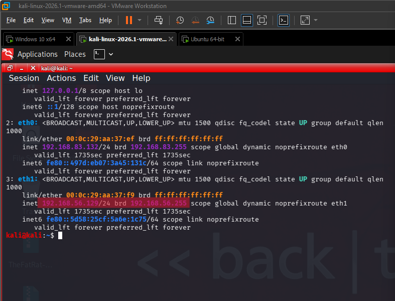
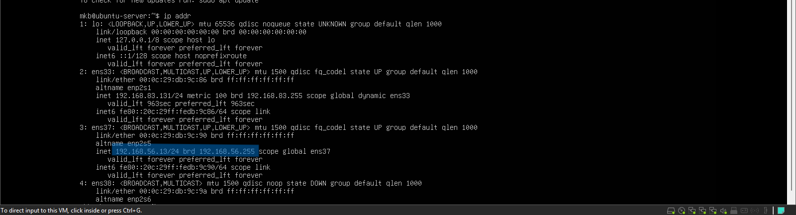
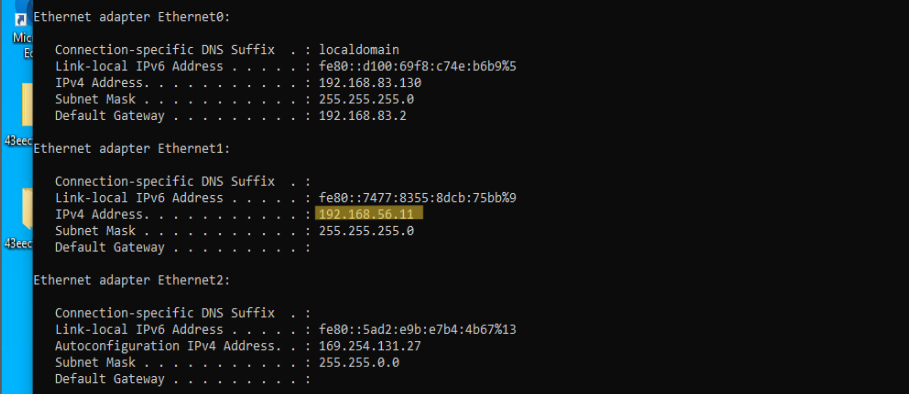
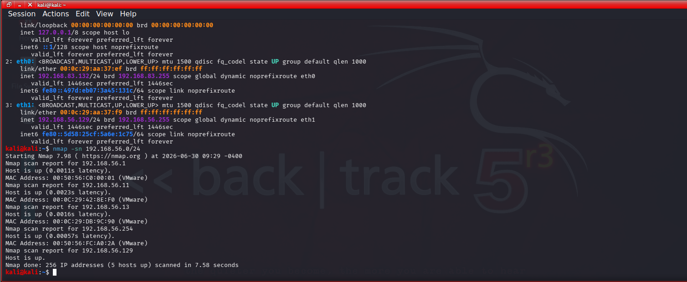

# Lab 01 - Network Discovery

## Scenario

The SOC receives a request to verify which devices are currently active on a newly deployed internal subnet before security monitoring rules are implemented. As a SOC analyst, you are tasked with identifying all reachable hosts to establish an accurate inventory of network assets.

## Objective

Perform host discovery on a VMware Host-Only network to identify active devices and verify their IP addresses using Nmap.


## Commands executed

### Kali Linux

```bash
ip addr
```
windows 10

```cmd
ipconfig
```

### Ubuntu server

```bash
ip addr
```
### Host Discovery

```bash
nmap -sn 192.168.56.0/24
```

## Findings

| Device              | IP Address     | Description               |
| ------------------- | -------------- | ------------------------- |
| Kali Linux          | 192.168.56.129 | Attacker Machine          |
| Windows 10          | 192.168.56.11  | Target Host               |
| Ubuntu Server       | 192.168.56.13  | Linux Server              |
| VMware Host Adapter | 192.168.56.1   | Host-Only Network Adapter |
| VMware DHCP Server  | 192.168.56.254 | DHCP Service              |


## Evidence


### Kali Linux network configuration



### Ubuntu Server network configuration



### Windows IP configuration



### Nmap host discovery results



## Analysis

The host discovery scan identified five active devices within the 192.168.56.0/24 Host-Only network. Three devices were virtual machines (Kali Linux, Windows 10, and Ubuntu Server), while the remaining two belonged to VMware's networking infrastructure. This demonstrates that Nmap can identify both endpoint systems and supporting network services during the reconnaissance phase.

## Key Takeaways
Successfully identified active hosts within the Host-Only network.

Verified IP addressing on Kali Linux, Windows 10, and Ubuntu Server.

Used Nmap to perform ICMP host discovery.

Recognized VMware networking components as part of the scan results.

Established a network inventory for subsequent security assessments.

## Skills Demonstrated

- Network Discovery
  
- Host Discovery
  
- ICMP Scanning
  
- Nmap Host Discovery
  
- Target Identification
  
- Network Enumeration

## Conclusion

This lab established the baseline network topology by identifying active hosts and their assigned IP addresses. The results provide a foundation for subsequent reconnaissance activities, including port scanning, service enumeration, operating system detection, and firewall analysis.
