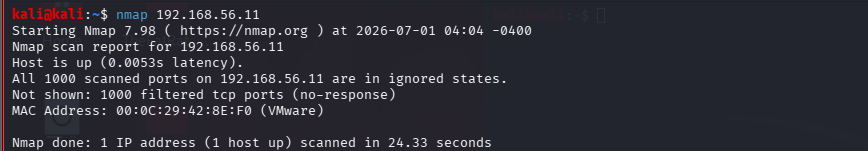
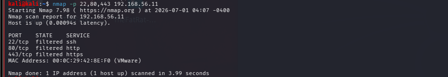
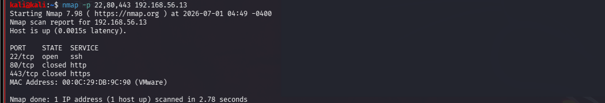
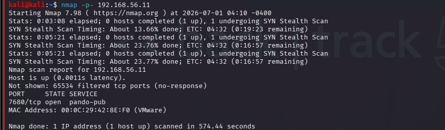
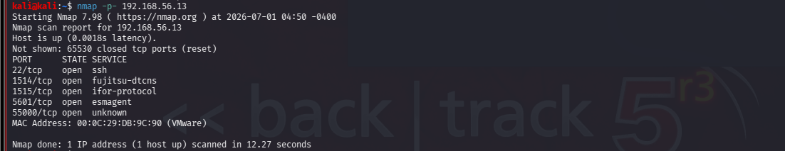

# Port Scanning with Nmap

## Scenario
The SOC received an alert that a newly deployed server may be exposing unnecessary network services to the internal network. As a SOC analyst, you have been tasked with identifying open TCP ports, determining which services are running, and assessing the server's attack surface to identify potential security risks.

## Objective

Perform TCP port scanning against Windows 10 and Ubuntu Server using Nmap to identify exposed network services and compare how different scan techniques reveal system information.

### Tools 

Nmap

Kali Linux

Windows machine

Ubuntu server

### Scan techniques

| Scan Type        | Command                     | Purpose                              |
| ---------------- | --------------------------- | ------------------------------------ |
| Default Scan     | `nmap <IP>`                 | Scan the 1,000 most common TCP ports |
| Specific Ports   | `nmap -p 22,80,443 <IP>`    | Scan selected ports                  |
| Port Range       | `nmap -p 1-1000 <IP>`       | Scan a defined range                 |
| Full TCP Scan    | `nmap -p- <IP>`             | Scan all 65,535 TCP ports            |
| TCP Connect Scan | `nmap -sT <IP>`             | Complete TCP three-way handshake     |
| SYN Scan         | `sudo nmap -sS <IP>`        | Perform a half-open (stealth) scan   |
| Save Output      | `nmap -oN results.txt <IP>` | Save scan results to a text file     |

### Default Port Scan
 
### Windows 10

Observation

The host was reachable, but most scanned ports appeared filtered, indicating that Windows Defender Firewall was restricting scan responses.

### Ubuntu Server

Observation

The default scan identified TCP port 22 (SSH) as open, while the remaining common ports were closed.

### Specific Ports Scan (22, 80, 443)

### Windows 10

Ports 22, 80, and 443 were reported as filtered, suggesting that firewall rules prevented Nmap from determining their state.

### Ubuntu Server

Port 22 (SSH) was open, while ports 80 (HTTP) and 443 (HTTPS) were closed, indicating that no web services were running.

Port Range Scan (1–1000)

### Windows 10

### Observation

Most ports within the scanned range remained filtered, limiting service enumeration.

### Ubuntu Server

Observation

The scan confirmed SSH (22/TCP) as the primary exposed service within the first 1,000 ports.

### Full Port Scan
   
### Windows 10

Observation

The full scan identified only a limited number of accessible ports, reflecting the effect of host-based firewall filtering.

### Ubuntu Server

Additional services were discovered during the full TCP scan, including ports 1514, 1515, and 5601, which were not identified during the default scan.

### SYN Scan

### Windows 10

Observation
The SYN scan detected port 7680/TCP as open, demonstrating that different scan techniques can reveal additional information.

### Ubuntu Server

The SYN scan confirmed the previously identified open ports while providing a faster and less intrusive method of reconnaissance.

## Analysis 

The port scans demonstrated how different Nmap scan techniques reveal varying levels of information about a target system. Ubuntu Server consistently exposed SSH (port 22) and additional services during the full TCP scan, while Windows 10 returned several filtered ports due to Windows Defender Firewall. The full port scan identified services that were not visible during the default scan, highlighting the importance of selecting an appropriate scanning technique during reconnaissance.

## Conclusion 

This lab provided practical experience with Nmap port scanning techniques in a controlled virtual environment. By comparing Windows 10 and Ubuntu Server, I learned how different operating systems and firewall configurations influence scan results. The knowledge gained from this lab establishes a strong foundation for the next stage of reconnaissance, which focuses on service version and operating system detection.

## Key Takeaways 

Performed multiple TCP port scanning techniques using Nmap.

Compared scan results between Windows 10 and Ubuntu Server.

Identified the difference between open, closed, and filtered ports.

Observed how firewall configurations affect scan results.

Verified that a full TCP scan can reveal additional services not found in a default scan.

## Skills Demonstrated

- TCP Port Scanning
  
- Open Port Identification
  
- Host Enumeration
  
- Nmap Port Scanning
  
- Network Reconnaissance
  
- Basic Attack Surface Identification

