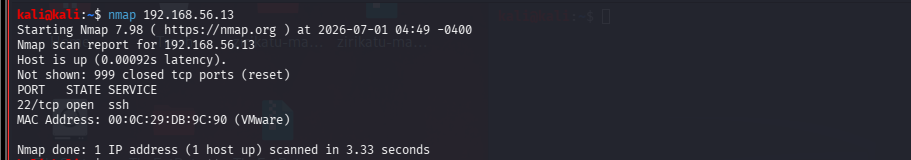
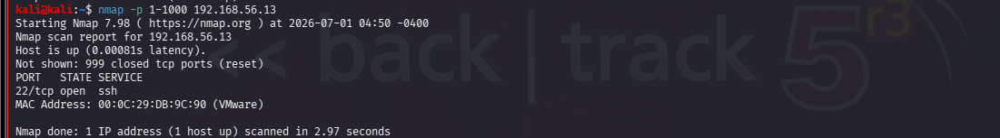
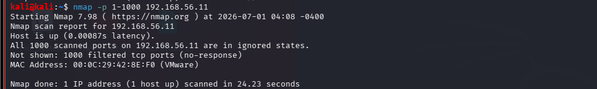
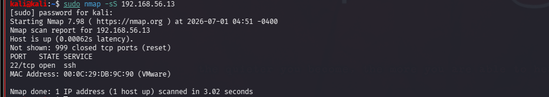
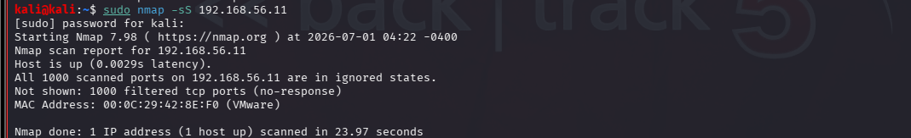

# Port Scanning with Nmap

# Port Scanning

This lab demonstrates the fundamentals of port scanning using Nmap.
There are a total of 65535 ports
   Well-known ports (0–1023)
   Registered ports (1024–49151)
   Dynamic/Ephemeral ports (49152–65535)

## Objective

The objective of this lab was to learn how to identify open ports on a target system using Nmap. The lab also explored different port scanning techniques and how scan results help identify exposed network services.

## Background

Port scanning is a reconnaissance technique used to discover which ports on a target system are open, closed, or filtered. Open ports indicate that a service is listening and may be accessible over the network.
Identifying these services helps security professionals understand a system's attack surface.

## Lab Environment

| Machine | Operating System | Purpose |
|---------|------------------|---------|
| Attacker Machine | Kali Linux | Performed Nmap port scanning. |
| Target Machine 1 | Ubuntu | Used as a Linux target for port scanning. |
| Target Machine 2 | Windows 10 | Used as a Windows target for port scanning. |

### Tools Used

- Nmap
- Virtualmachine ( VMware workstation) or Oracle virtualbox depending on what you are using

## Commands Used

### 1. Default Port Scan

```bash
nmap <target-ip>
```

**Example**

```bash
nmap 192.168.56.11
```

**Explanation**

- `nmap` – Launches the Nmap scanner.
- `<target-ip>` – The IP address of the target machine.
- By default, Nmap scans the **top 1,000 most common TCP ports** to identify which are open.

---

### 2. Scan Specific Ports

```bash
nmap -p 22,80,443 <target-ip>
```

**Explanation**

- `-p` = **Ports**. Specifies which port(s) to scan.
- `22` = SSH
- `80` = HTTP
- `443` = HTTPS

This command scans only the specified ports instead of the default top 1,000 ports.

---

### 3. Scan a Range of Ports

```bash
nmap -p 1-1000 <target-ip>
```

**Explanation**

- `-p` = **Ports**
- `1-1000` = Scans ports 1 through 1000.

---

### 4. Scan All TCP Ports

```bash
nmap -p- <target-ip>
```

**Explanation**

- `-p-` = Scans **all TCP ports (1–65535)**.

---

### 5. TCP Connect Scan

```bash
nmap -sT <target-ip>
```

**Explanation**

- `-sT` = **TCP Connect Scan**
- Performs a full TCP three-way handshake.
- Does **not** require root/administrator privileges.

---

### 6. SYN Scan

```bash
sudo nmap -sS <target-ip>
```

**Explanation**

- `sudo` = Runs the command with administrator (root) privileges.
- `-sS` = **SYN Scan** (also called a stealth or half-open scan).
- Faster than a TCP Connect scan and commonly used in security assessments.

---

### 7. Save Scan Results

```bash
nmap -oN port-scan-results.txt <target-ip>
```

**Explanation**

- `-oN` = **Output Normal**. Saves the scan output in a human-readable text file.
- `port-scan-results.txt` = Name of the output file.

## Results
### 1. Default Port Scan

**Command**

```bash
nmap <target-ip>
```


#### Ubuntu


**Findings**

- Host was up.
- Port 22 (SSH) was open.
- Remaining common ports were closed.

#### Windows


**Findings**

- Host was reachable.
- Most ports were filtered.
- Firewall appeared to block scan responses.

---
### 2. Specific Ports Scan

```bash
nmap -p 22,80,443 <target-ip>
```

#### Ubuntu



#### Windows



---
### 3. Port Range Scan

```bash
nmap -p 1-1000 <target-ip>
```

#### Ubuntu


#### Windows


---
### 4. All Ports Scan

```bash
nmap -p- <target-ip>
```

#### Ubuntu


#### Windows


---
### 5. SYN Scan

```bash
sudo nmap -sS <target-ip>
```

#### Ubuntu



#### Windows



---
## Analysis


The port scans demonstrated how Nmap identifies network services exposed on different operating systems. The Ubuntu machine consistently showed port 22 (SSH) as open, indicating that remote access via SSH was enabled. When all TCP ports were scanned, additional open ports (1514, 1515, and 5601) were discovered, showing that a full port scan can reveal services that are not identified during the default scan.

The Windows machine produced different results, with many ports appearing as filtered during the default scan. This suggests that firewall rules were restricting responses to Nmap probes. However, the SYN scan detected port 7680 as open, demonstrating that different scanning techniques can produce different results depending on the target's configuration.

Overall, the lab highlighted the importance of selecting appropriate scan types and interpreting scan results based on the operating system and network security controls.


## Key Takeaways


- Learned how to perform port scanning using Nmap.
- Understood the purpose of the default, specific port, port range, full port, and SYN scans.
- Learned the difference between open, closed, and filtered ports.
- Observed that Ubuntu and Windows respond differently to port scans.
- Discovered that scanning all ports may reveal additional services not detected by a default scan.
- Improved understanding of how firewall configurations affect scan results.

## Conclusion

This lab introduced the fundamentals of port scanning using Nmap in a controlled environment. By scanning both Ubuntu and Windows systems, I gained practical experience in identifying open ports, interpreting scan results, and comparing how different operating systems respond to network reconnaissance. The knowledge gained from this lab provides a solid foundation for the next stage of reconnaissance, which involves identifying the services and operating systems running on the discovered open ports.

## Next Steps

The next lab will focus on Service Version Detection and Operating System Detection using Nmap to identify the software versions and operating systems running on the discovered open ports.
