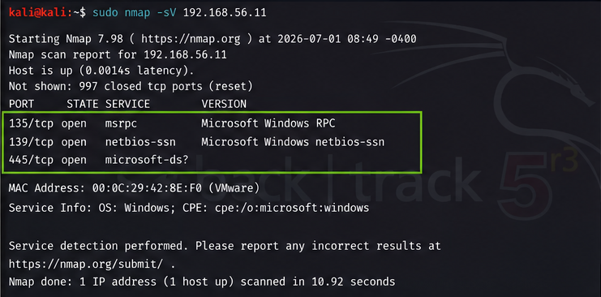
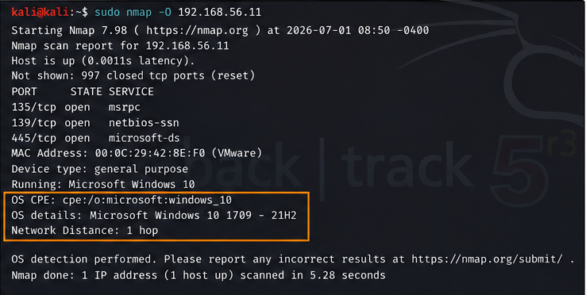
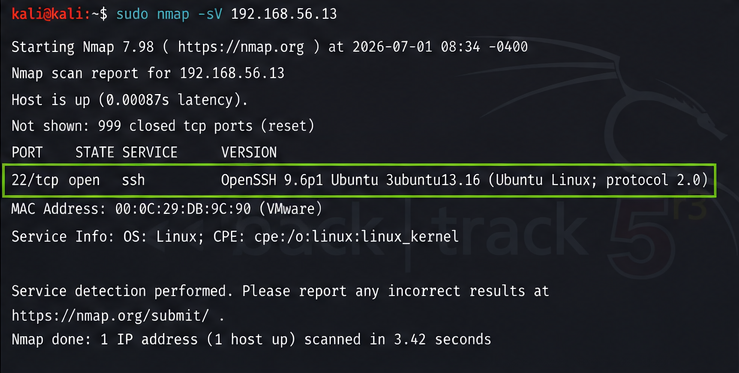
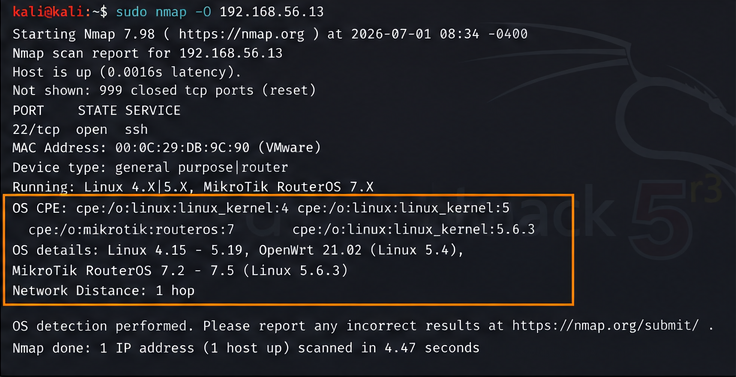

## 03: Service & Operating System Detection

### Objective

Perform service version and operating system detection against Windows 10 and Ubuntu Server using Nmap to identify exposed services, software versions, and operating system fingerprints during the reconnaissance phase of a security assessment.

### Lab Environment

| Component  | Details             |
| ---------- | ------------------- |
| Hypervisor | VMware Workstation  |
| Attacker   | Kali Linux          |
| Target 1   | Windows 10          |
| Target 2   | Ubuntu Server (CLI) |
| Tools      | Nmap                |

### Network Configuration

| Machine       | IP Address    |
| ------------- | ------------- |
| Kali Linux    | 192.168.56.15 |
| Windows 10    | 192.168.56.11 |
| Ubuntu Server | 192.168.56.13 |

### Commands Executed

| Task                       | Command             | Purpose                                             |
| -------------------------- | ------------------- | --------------------------------------------------- |
| Service Version Detection  | `nmap -sV <IP>`     | Identify services and software versions             |
| Operating System Detection | `sudo nmap -O <IP>` | Detect operating system using TCP/IP fingerprinting |

## Results

### Windows Service Version Detection

Command

```bash
nmap -sV 192.168.56.11
```
### Evidence



### Observation

Host was reachable.

Open ports identified:

TCP/135 – MSRPC

TCP/139 – NetBIOS-SSN

TCP/445 – Microsoft-DS

Nmap successfully identified Microsoft network services.

### Windows Operating System Detection

Command

```bash
sudo nmap -O 192.168.56.11
```
### Evidence




Observation

Target identified as Microsoft Windows 10.

OS fingerprint matched with high confidence.

Estimated network distance: 1 hop.

### Ubuntu Service Version Detection

Command

```bash
nmap -sV 192.168.56.13
```

### Evidence



### Observation

Host responded successfully.

TCP port 22 (SSH) was open.

Service identified as OpenSSH 9.6p1.

### Ubuntu Operating System Detection

Command

```bash
sudo nmap -O 192.168.56.13
```

### Evidence



### Observation

Target identified as a Linux-based operating system.

Linux kernel fingerprint successfully detected.

Estimated network distance: 1 hop.

### Comparative Analysis

| Feature          | Windows 10                   | Ubuntu Server  |
| ---------------- | ---------------------------- | -------------- |
| Open Services    | MSRPC, NetBIOS, Microsoft-DS | OpenSSH        |
| Attack Surface   | Larger                       | Smaller        |
| OS Detection     | Windows 10 detected          | Linux detected |
| Network Distance | 1 Hop                        | 1 Hop          |


## Analysis

The reconnaissance successfully identified services, software versions, and operating systems on both targets. Windows 10 exposed multiple networking services related to file sharing and remote communication, increasing its attack surface compared to Ubuntu Server, which exposed only SSH.

During initial testing, Windows Defender Firewall limited the information returned by Nmap. After temporarily disabling the firewall for testing purposes, service enumeration and operating system fingerprinting became significantly more accurate. This demonstrates how host-based firewalls reduce information disclosure during reconnaissance and complicate attacker enumeration efforts.


## Key Takeaways

Performed service version detection using Nmap (-sV).

Identified operating systems using TCP/IP fingerprinting (-O).

Compared service exposure between Windows 10 and Ubuntu Server.

Observed the impact of Windows Defender Firewall on reconnaissance results.

Demonstrated how service enumeration supports vulnerability assessment and attack surface analysis.

## Conclusion

This lab demonstrated the use of Nmap to identify running services, software versions, and operating systems on Windows 10 and Ubuntu Server. The results showed how operating system configuration and firewall policies influence reconnaissance outcomes and highlighted the value of service enumeration in understanding a target's attack surface. These findings provide a strong foundation for subsequent labs focused on firewall configuration, traffic analysis, intrusion detection, and security monitoring.


