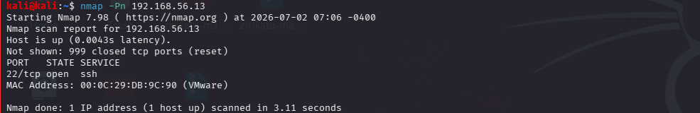
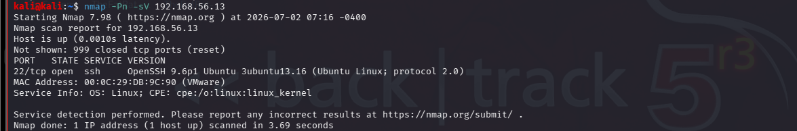

## Lab 04 - Firewall Fundamentals

### Objective

Evaluate how host-based firewalls affect network reconnaissance by performing baseline scans and comparing scan results before and after firewall configuration.

### Lab Environment

| Machine  | Operating System                     | Role                      |
| -------- | ------------------------------------ | ------------------------- |
| Attacker | Kali Linux                           | Reconnaissance & Scanning |
| Target 1 | Windows 10                           | Windows Target            |
| Target 2 | Ubuntu Server                        | Linux Server Target       |
| Tools    | Nmap, Windows Defender Firewall, UFW | Security Tools            |


### Network Configuration

Before scanning, determine the IP address of each machine.

Kali Linux:

| Machine       | IP Address    |
| ------------- | ------------- |
| Kali Linux    | 192.168.56.15 |
| Windows 10    | 192.168.56.11 |
| Ubuntu Server | 192.168.56.13 |


### Connectivity Verification
```bash
ping 192.168.56.11
ping 192.168.56.13
```


### Results

| Target        | Status    | Packet Loss |
| ------------- | --------- | ----------- |
| Windows 10    | Reachable | 0%          |
| Ubuntu Server | Reachable | 0%          |

### Observation

Both target machines were reachable from Kali Linux, confirming successful network connectivity before reconnaissance.


## Baseline Nmap Scans


### Windows machine

Command

```bash
nmap -Pn 192.168.56.11
```

 

### Observation

Host was reachable.

Open ports were identified before firewall modifications.

### Windows Service Detection

Command

```bash
nmap -Pn -sV 192.168.56.11
```


### Observation

Service version detection successfully identified services running on exposed ports.

### Scan Ubuntu Server

 Ubuntu Server 

Command

```bash
nmap -Pn 192.168.56.13
```



### Observation

Ubuntu Server responded to the scan and exposed active network services.

### Ubuntu Service Detection

Command

```bash
nmap -Pn -sV 192.168.56.13
```



## Observation

Service version detection identified the active services running on Ubuntu Server.

Baseline Assessment

Both Windows 10 and Ubuntu Server were successfully discovered from Kali Linux. Baseline scans identified reachable hosts, open ports, and running services prior to implementing firewall rules. These results provide a reference point for evaluating the impact of firewall configurations in subsequent tests.

Outbound Rules

Connection Security Rules

Monitoring
