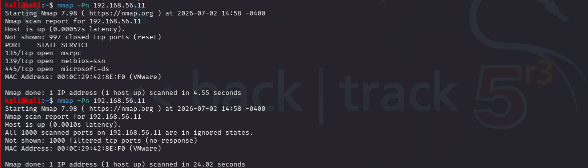
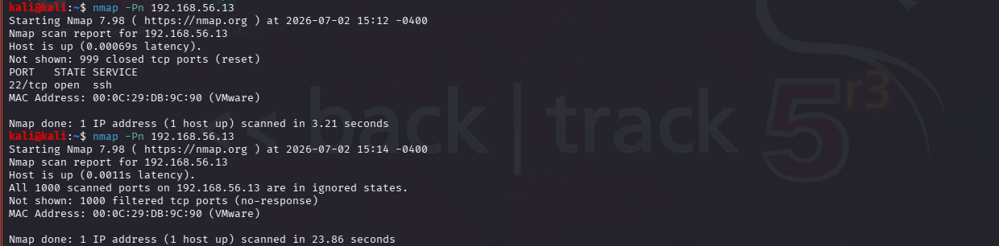

## Lab 04 - Firewall Fundamentals

### Scenario

During a routine security review, the SOC identified that a Linux server was accepting unnecessary inbound network connections, increasing its attack surface. As a SOC analyst, you have been tasked with reviewing the firewall configuration, implementing appropriate access control rules, and verifying that only authorized services are accessible.

### Objective

Evaluate how host-based firewalls affect network reconnaissance by performing baseline scans and comparing scan results before and after firewall configuration.


### Tools

Nmap

Windows Defender Firewall

Ubuntu server Firewall (UFW)

### Network Configuration

Before scanning, determine the IP address of each machine and note/save it.

### Connectivity Verification

```bash
ping 192.168.56.11
ping 192.168.56.13
```


### Results

| Target        | Status    | Packet Loss |
| ------------- | --------- | ----------- |
| Windows 10    | Reachable | 0%          |
| Ubuntu Server | Reachable | 0%          |

### Observation

Both target machines were reachable from Kali Linux, confirming successful network connectivity before reconnaissance.


## Baseline Nmap Scans


### Windows machine

Command

```bash
nmap -Pn 192.168.56.11
```

 

### Observation

Host was reachable.

Open ports were identified before firewall modifications.

### Windows Service Detection

Command

```bash
nmap -Pn -sV 192.168.56.11
```


### Observation

Service version detection successfully identified services running on exposed ports.

### Scan Ubuntu Server

 Ubuntu Server 

Command

```bash
nmap -Pn 192.168.56.13
```


### Observation

Ubuntu Server responded to the scan and exposed active network services.

### Ubuntu Service Detection

Command

```bash
nmap -Pn -sV 192.168.56.13
```


### Observation

Service version detection identified the active services running on Ubuntu Server.

Baseline Assessment

Both Windows 10 and Ubuntu Server were successfully discovered from Kali Linux. Baseline scans identified reachable hosts, open ports, and running services prior to implementing firewall rules. These results provide a reference point for evaluating the impact of firewall configurations in subsequent tests.

## Firewall Configuration

Enable Windows Defender Firewall and Ubuntu server UFW and perform scan

### Evidence

 Windows Defender Firewall (Before/After)





Ubuntu Server UFW (Before/After)



### Observation

Firewall filtered some ports.

Less information was exposed.

### Comparison

| Feature           | Before     | After            |
| ----------------- | ---------- | ---------------- |
| Host Reachability | Reachable  | Reachable        |
| Open Ports        | Visible    | Reduced/Filtered |
| Service Detection | Successful | Limited          |

## Key Takeaways

Firewalls reduce the attack surface.

Nmap results change after firewall rules are applied.

Proper firewall configuration improves host security. 

## Skills Demonstrated

- Windows Defender Firewall Analysis
  
- UFW (Uncomplicated Firewall) Administration
  
- Firewall Rule Configuration
  
- Network Connectivity Testing
  
- Firewall Impact Analysis
  
- Port Filtering Analysis
  
- Security Control Validation

## Conclusion

Enabling Windows Defender Firewall and UFW reduced information available during network reconnaissance, demonstrating the effectiveness of host-based firewalls.
