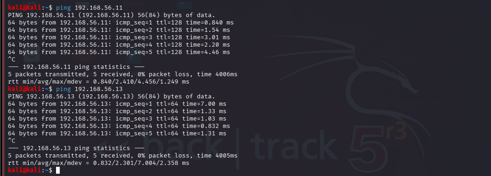
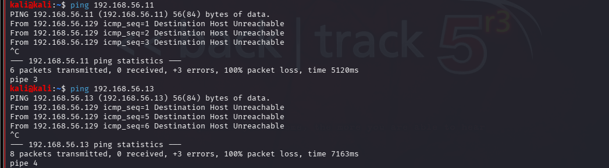
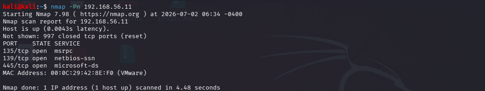
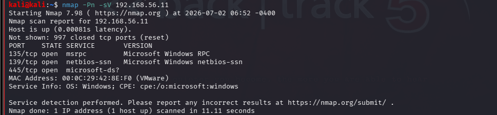

## Lab 04 - Firewall Fundamentals

## Objective

Learn the fundamentals of host-based firewalls by configuring firewall rules on Windows 10 and Ubuntu Server, then observe how those rules affect network reconnaissance using Nmap from Kali Linux.

## Lab Environment

| Machine  | Operating System                     | Role                      |
| -------- | ------------------------------------ | ------------------------- |
| Attacker | Kali Linux                           | Reconnaissance & Scanning |
| Target 1 | Windows 10                           | Windows Target            |
| Target 2 | Ubuntu Server                        | Linux Server Target       |
| Tools    | Nmap, Windows Defender Firewall, UFW | Security Tools            |


## STEP 1 — Identify IP Addresses

Before scanning, determine the IP address of each machine.

Kali Linux:

```Bash
ip addr
```
or


```Bash
ip a
```
Kali IP: 192.168.56.15

Windows 10:

Open Cmd:

```
ipconfig
```

Windows IP: 192.168.56.11

Ubuntu server:

```Bash
ip addr
```

or

```Bash
ip a
```
Ubuntu IP: 192.168.56.13

## STEP 2 — Verify Connectivity

From Kali Linux:

```
ping <Windows-IP>
```
Then,

```
ping <Ubuntu-IP>
```

### Observation

Are replies received?

Any packet loss?





Host up and active

ping 192.168.56.11 (windows machine) 5 packets transmitted, 5 packets received, 0% packet loss

ping 192.168.56.11 (Ubuntu server machine) 5 packets transmitted, 5 packets received, 0% packet loss

Host down
 


ping 192.168.56.11 (windows machine) 6 packets transmitted, 0 packets received, 100% packet loss

ping 192.168.56.13 (Ubuntu server  machine) 8 packets transmitted, 0 packets received, 100% packet loss

### STEP 3 – Baseline Nmap Scans

### Objective

Perform reconnaissance from Kali Linux against both target machines before making any firewall changes. These results will serve as the baseline for comparison later in the lab.

### 3.1 Scan Windows machine

From Kali Linux, run:

nmap -Pn <Windows-IP>

Example:

```bash
nmap -Pn 192.168.56.11
```
nmap - Starts the network scan.

-Pn - Treats the host as online and skips the ping (host discovery) phase. This is useful because some firewalls block ping requests.

Record the Results

Answer these questions:

Which ports are open?

Which ports are closed?

Is the host reachable?

 

### 3.2 Service Version Detection (Windows)

Run:

nmap -Pn -sV <Windows-IP>

Example:
```bash
nmap -Pn -sV 192.168.56.11
```

-sV - Attempts to identify the service and version running on each open port.

#### Observe

What services are running?

Which ports are providing those services?



### 3.3 Scan Ubuntu Server

Now scan your Ubuntu Server from Kali Linux:

nmap -Pn <Ubuntu-IP>

Example:

```bash
nmap -Pn 192.168.56.11
```


### 3.4 Service Version Detection (Ubuntu)

nmap -Pn -sV <Ubuntu-IP>

Example:

```bash
nmap -Pn -sV 192.168.56.13
```


## Observation

Before configuring any firewall rules, Kali Linux successfully discovered both target systems. The scans identified open ports and running services on Windows 10 and Ubuntu Server. These baseline results will be used later to compare how firewall configurations affect host visibility and service accessibility.

