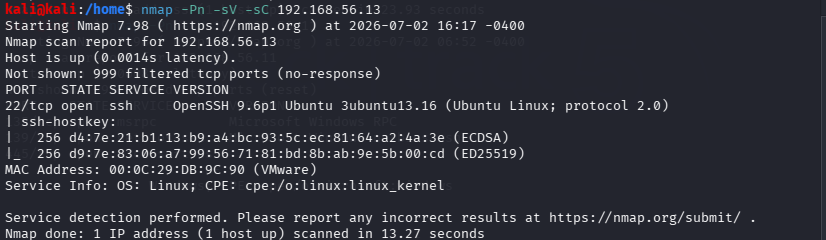
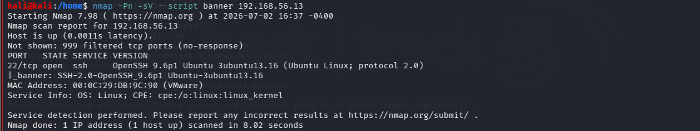
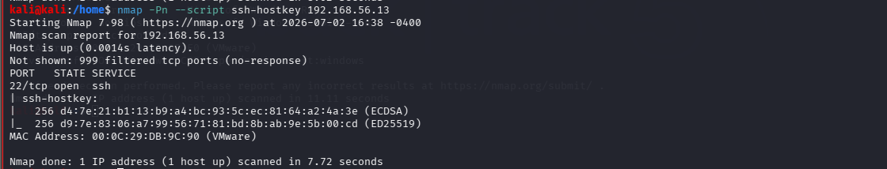

# Lab 05 - Nmap Scripting Engine (NSE)

## Objective

Use Nmap Scripting Engine (NSE) to gather more information about target systems and perform safe enumeration of network services.

## Lab Environment

| Machine       | Operating System | Role     |
| ------------- | ---------------- | -------- |
| Kali Linux    | Linux            | Attacker |
| Windows 10    | Windows          | Target   |
| Ubuntu Server | Ubuntu           | Target   |

## Tools

-Nmap

-NSE Scripts

### Commands

nmap -Pn -sC 192.168.56.11

nmap -Pn ---script banner 192.168.56.11

nmap -Pn -sC 192.168.56.13

nmap -Pn --script banner 192.168.56.13

nmap -Pn --script ssh-hostkey 192.168.56.13

Firewall blocks open ports therefore we intentionally open port 22 for observation

