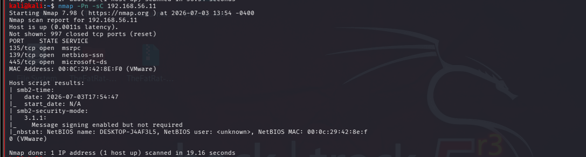
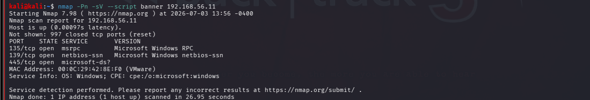

# Lab 05 - Nmap Scripting Engine (NSE)

## Objective

Use Nmap Scripting Engine (NSE) to gather more information about target systems and perform safe enumeration of network services.

## Lab Environment

| Machine       | Operating System | Role     |
| ------------- | ---------------- | -------- |
| Kali Linux    | Linux            | Attacker |
| Windows 10    | Windows          | Target   |
| Ubuntu Server | Ubuntu           | Target   |

## Tools

-Nmap

-NSE Scripts

### Commands


nmap -Pn -sC 

nmap -Pn ---script banner

### Winndows



### Observation 

Target successfully reached and responded to the scan.

Identified 3 open TCP ports

NSE scripts gathered additional SMB information, security mode indicated that message signing was enabled but not required.

Identified the NetBIOS computer name of the Windows host.

These reconnaissance  provide useful information for identifying Windows systems and exposed services.



### Observation 

Banner grabbing successfully identified the services running on the open ports.

Target operating system identifiied as Windows.

Banner information helps verify exposed services 

### Ubuntu Server

Since UFW blocked all incoming services, port 22 (SSH) was temporarily allowed to demonstrate safe NSE enumeration.

 banner grabbing
 


### ssh-hostkey retrieval

```bash
nmap -Pn --script ssh-hostkey 192.168.56.13
```

