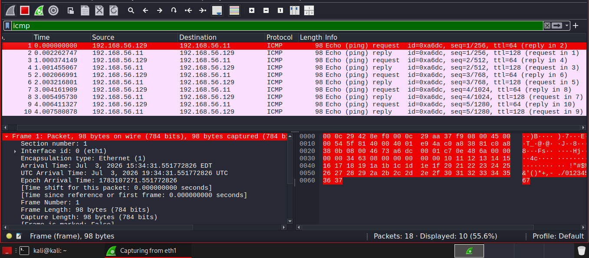
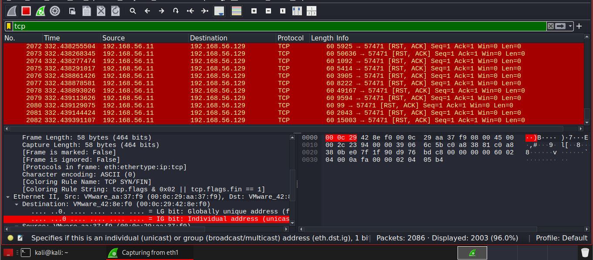

# 06 – Network Traffic Analysis (ICMP & TCP Analysis)

## Objective

Capture and analyze network traffic  to identify common network protocols and understand communication between hosts.

## Lab Environment

| Machine       | Operating System | Role           |
| ------------- | ---------------- | -------------- |
| Kali Linux    | Linux            | Packet Capture |
| Windows 10    | Windows          | Target         |


## Tools

Wireshark

Ping

Nmap

### ICMP Analysis

```bash
ping 192.168.56.11
```


### Analysis
The ICMP traffic confirmed normal network connectivity between the attacker and target machines.

Echo Request and Echo Reply packets indicate successful host communication.

ICMP traffic is commonly used for connectivity testing but may also be used by attackers during network reconnaissance.


### TCP Analysis

```bash
nmap -Pn 192.168.56.11
```


Now you'll see:

TCP SYN packets

TCP SYN/ACK packets (for open ports)

TCP RST packets (for closed ports)

### Analysis

The captured TCP traffic indicates that a port scan was performed against the target.

Multiple TCP connection attempts are characteristic of reconnaissance activity.

Monitoring unusual TCP scanning activity can help detect potential attackers during the early stages of an intrusion.


## Conclusion

Wireshark successfully captured and analyzed ICMP and TCP network traffic generated during connectivity testing and port scanning. The packet analysis demonstrated how network communication can be monitored and interpreted, providing valuable insight into normal network behavior and reconnaissance activities.

### Key Takeaways

Wireshark captures network traffic in real time. 

ICMP packets verify network connectivity between hosts.

TCP packets reveal how hosts communicate and how port scanning works.

Packet analysis provides visibility into network activity that may indicate legitimate administration or malicious reconnaissance.

Understanding network traffic is a fundamental skill for SOC analysts when investigating security events.

## Skills Demonstrated

- Packet Capture
  
- Packet Analysis
  
- Protocol Identification
  
- ICMP Traffic Analysis
  
- TCP Traffic Analysis
  
- Wireshark Filtering
  
- Network Monitoring
  
- Basic SOC Investigation


