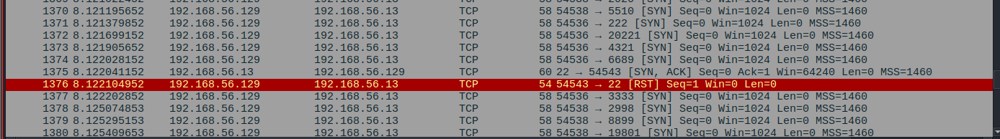
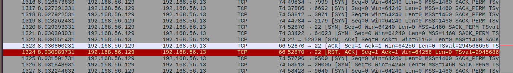
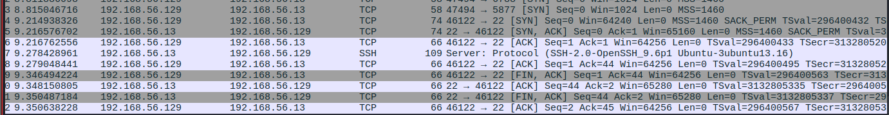

# Lab 08 – Detecting Network Reconnaissance Using Nmap and Wireshark

This lab simulates a SOC investigation into suspected network reconnaissance on an internal network.

## Objective

The objective of this investigation is to detect, analyze, and document network reconnaissance performed using Nmap. Packet captures collected with Wireshark are analyzed to identify host discovery, port scanning, and service enumeration activities while documenting indicators of compromise (IOCs) and defensive recommendations.

## Lab Environment


| Component           | Details                      |
| ------------------- | ---------------------------- |
| Attacker            | Kali Linux                   |
| Target              | Ubuntu Server                |
| Packet Analyzer     | Wireshark                    |
| Tool                | Nmap                         |

## Investigation Workflow

i) Reconnaissance Alert
       
ii) Capture Network Traffic
        
iii) Analyze Packet Capture
      
iv) Identify Scan Type
       
v) Collect Evidence
        
vi) Document Findings
        
vii) Recommend Mitigation

## Tools

| Tool              | Purpose                                               |
| ----------------- | ----------------------------------------------------- |
| Nmap              | Host discovery, port scanning and service enumeration |
| Wireshark         | Packet capture and protocol analysis                  |
| Ubuntu SSH Server | Target host     (192.168.56.13)                       |
| Kali Linux        | Scanning workstation    (192.168.56.129)              |

## Investigation Procedure

#### Step 1

Verify connectivity between Kali and Ubuntu.

#### Step 2

Start packet capture using Wireshark.

#### Step 3

Perform Host Discovery

```bash
nmap -sn 192.168.56.13
```


#### Step 4

Perform SYN Scan

Observe open port 22

```bash
sudo nmap -sS 192.168.56.13
```


Step 5

Perform TCP Connect Scan

```bash
nmap -sT 192.168.56.13
```
Observe open port 22



Step 6

Perform Service Enumeration

Observe open port 22

```bash
sudo nmap -sV 192.168.56.13
```

