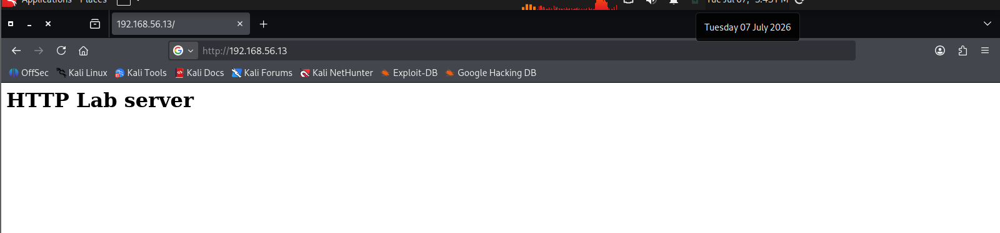
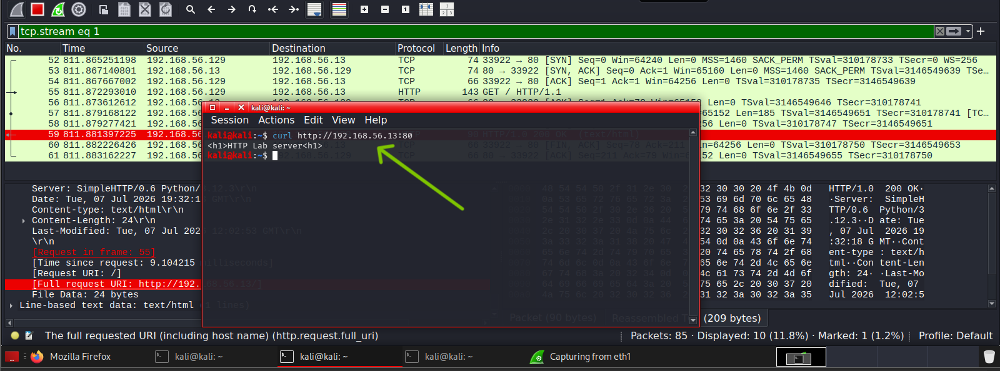

# Lab 09 – Investigating HTTP Web Traffic 

## Objective

The objective of this lab is to investigate HTTP traffic using Wireshark by capturing and analyzing web requests and responses between a client and a web server. The lab demonstrates how unencrypted web traffic can be inspected to identify requested resources, HTTP methods, response codes, headers, and transmitted content.

## Lab Environment

| Machine            | Role                 |
| ------------------ | -------------------- |
| Kali Linux         | Client               |
| Ubuntu Server      | HTTP Server          |
| Wireshark          | Packet Capture       |
| Python HTTP Server | Web Service          |

## Tools

| Tool               | Purpose                     |
| ------------------ | --------------------------- |
| Wireshark          | Capture and inspect packets |
| Python HTTP Server | Host a simple webpage       |
| Firefox / curl     | Generate HTTP traffic       |

### STEP 1 — Start the HTTP Server port 80

```bash
cd ~/web
sudo python3 -m http.server 80
```


The server is now listening on TCP port 80 and waiting for incoming HTTP requests.

## STEP 2 — Start Wireshark

Start packet capture

STEP 3 — Generate HTTP Traffic

From Kali:

Browser:
```bash
http://192.168.56.13
```


OR

```bash
curl http://192.168.56.13
```

