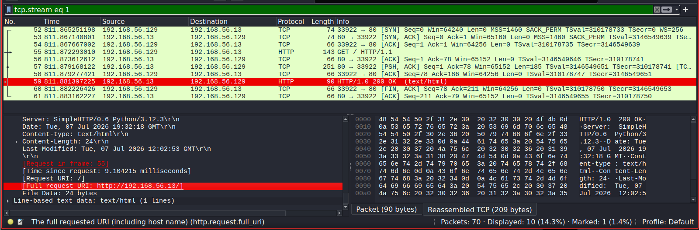
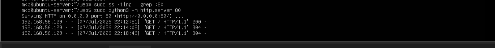
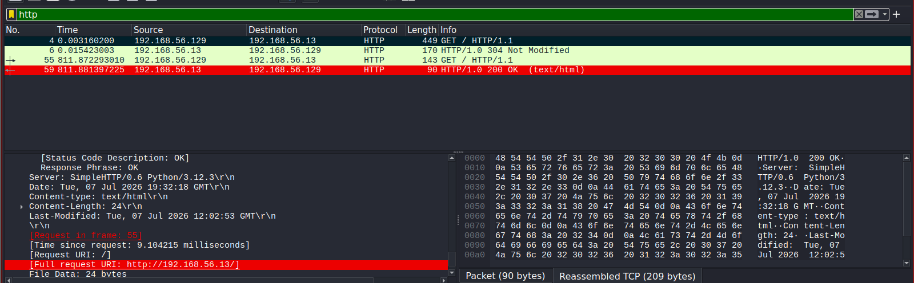
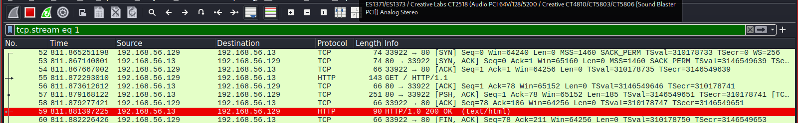
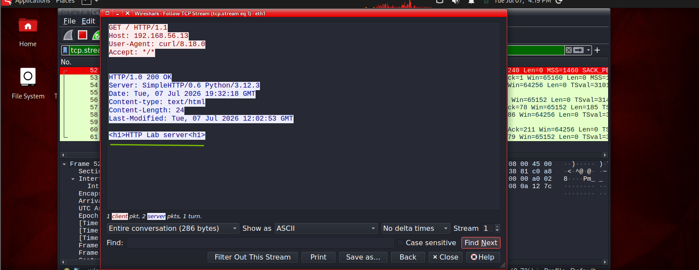

# Lab 09 – Investigating HTTP Web Traffic 

## Objective

The objective of this lab is to investigate HTTP traffic using Wireshark by capturing and analyzing web requests and responses between a client and a web server. The lab demonstrates how unencrypted web traffic can be inspected to identify requested resources, HTTP methods, response codes, headers, and transmitted content.

## Lab Environment

| Machine            | Role                 |
| ------------------ | -------------------- |
| Kali Linux         | Client               |
| Ubuntu Server      | HTTP Server          |
| Wireshark          | Packet Capture       |
| Python HTTP Server | Web Service          |

## Tools

| Tool               | Purpose                     |
| ------------------ | --------------------------- |
| Wireshark          | Capture and inspect packets |
| Python HTTP Server | Host a simple webpage       |
| Firefox / curl     | Generate HTTP traffic       |

### STEP 1 — Start the HTTP Server port 80

```bash
cd ~/web
sudo python3 -m http.server 80
```


The server is now listening on TCP port 80 and waiting for incoming HTTP requests.

## STEP 2 — Start Wireshark

Start packet capture

### Analysis

Packet capture begins before any client activity to ensure the complete communication is recorded, including TCP connection establishment, HTTP requests, and server responses.



## STEP 3 — Generate HTTP Traffic

Browser:

```bash
http://192.168.56.13
```


OR

```bash
curl http://192.168.56.13
```


### Analysis

The client successfully connected to the web server and retrieved the default webpage (index.html) using the HTTP protocol.

## STEP 4 — Observe the Server Logs

Ubuntu terminal should display something similar



### Analysis

The log confirms the client requested  webpage. The server responded with HTTP status code 200 OK, indicating the request was successfully processed, or 304 Not modified (retrieved same content from previous retrieval)

## STEP 5 — Analyze HTTP Traffic in Wireshark

### HTTP GET Request

 Filter to 

 ```
http
```


### Observation

The client transmitted an HTTP GET request requesting /index.html.The status code 200 OK confirms the requested webpage existed and was delivered successfully.

### Analysis

A GET request retrieves resources from a web server without modifying server data. HTTP headers provide metadata, Host, User-Agent, Accept, Server, Content-Type, Content-Length describing the request and response.

### TCP Three-Way Handshake

The communication began with:

```
SYN
SYN/ACK
ACK
```
### Analysis

Before any HTTP data was exchanged, a TCP session was established between the client and server, ensuring reliable communication.



### Analysis

Before any HTTP data was exchanged, a TCP session was established between the client and server, ensuring reliable communication.

Selecting Follow  TCP Stream displayed the webpage content:

```
<h1>Lab HTTP Server</h1>
```



### Analysis

HTTP traffic is transmitted in plaintext. Anyone monitoring the network can view the transmitted content, making HTTP unsuitable for sensitive information.
Indicators of Compromise (IOCs)

| Indicator         | Description                |
| ----------------- | -------------------------- |
| TCP Port 80       | HTTP communication         |
| GET request       | Resource retrieval         |
| HTTP 200 OK       | Successful server response |
| Plaintext webpage | Unencrypted content        |
| Client IP         | Request origin             |
| Server IP         | Destination host           |
