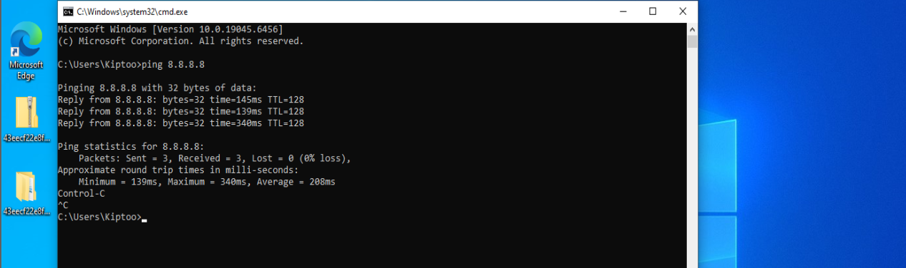
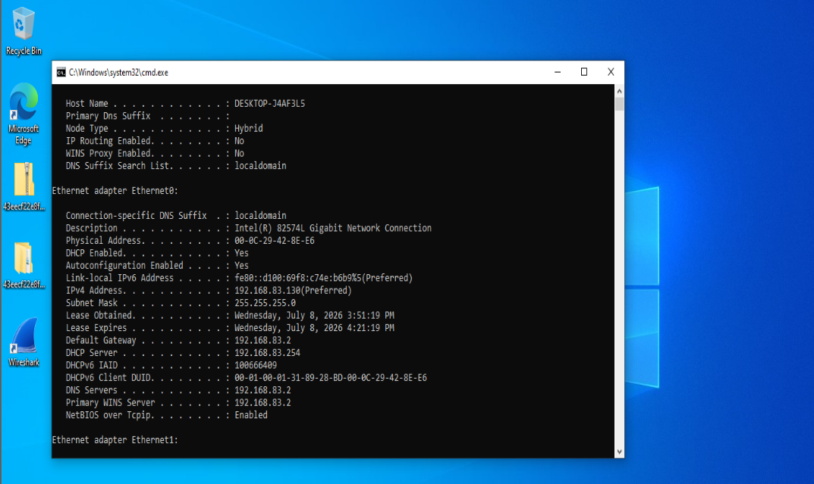
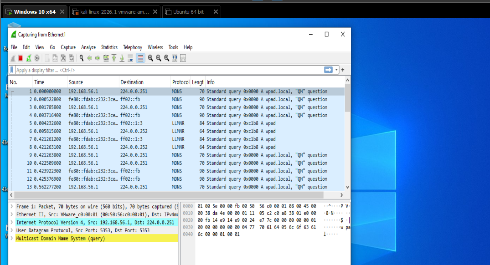
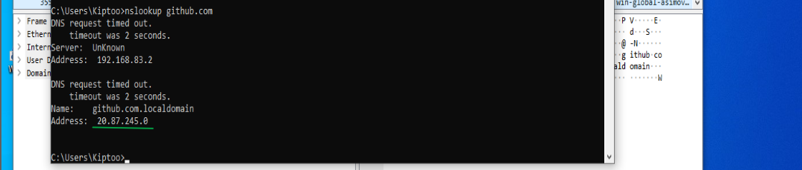
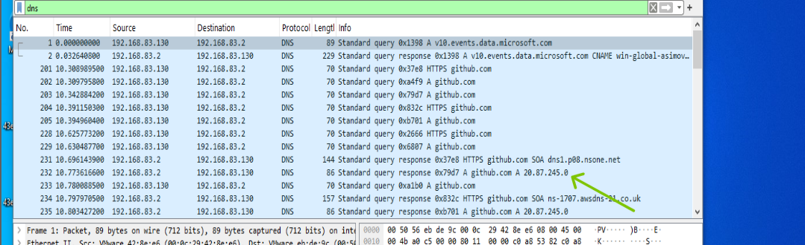

# Lab 10 – Investigating DNS Traffic and Domain Resolution Using Wireshark

## Scenario

The Security Operations Center (SOC) received an alert indicating that a Windows 10 workstation was making repeated DNS requests to external domains. As a SOC analyst, you have been tasked with investigating the DNS traffic to determine which domains were queried, verify whether the requests were successful, and identify any indicators of suspicious activity.

## Objective

The objective of this investigation is to capture and analyze DNS traffic generated by a Windows 10 workstation using Wireshark. The investigation focuses on examining DNS queries, responses, transaction IDs, resource records, and response codes to understand the domain resolution process and identify potential Indicators of Compromise (IOCs).

### Tools

Wireshark

cmd

nslookkup

ipconfig

Browser

### Step 1 – Verify Network Connectivity

On the Windows workstation, verify network connectivity before generating DNS traffic.

```cmd
ping 8.8.8.8
```
8.8.8.8 – Google's public DNS server.



#### Analysis

Successful connectivity confirms the system can communicate with external networks and is ready to perform DNS resolution.

### Step 2 – Identify the Configured DNS Server

```
ipconfig /all
```


#### Analysis

The workstation displayed its configured DNS server(s). Identifying the DNS server helps analysts determine where DNS queries are sent and assists in correlating captured network traffic.

### Step 3 – Start Packet Capture

Open Wireshark



#### Analysis

Starting packet capture before user activity ensures all DNS requests and responses are collected for investigation.

Step 4 – Clear the DNS Cache

```cmd
ipconfig /flushdns
```

#### Analysis

Flush the cache to ensure Windows perform fresh DNS lookups, ensuring new DNS traffic is visible in Wireshark.

### Step 5 – Generate DNS Traffic

Run

```
nslookup github.com
```


### Observation

The DNS lookup initially experienced a timeout before successfully resolving the requested domain. The response returned the queried hostname with the configured DNS search suffix appended (i.e  github.com.localdomain) and provided a valid IP address.

The observed behavior indicates that the  virtual network environment automatically appended the configured DNS search suffix (.localdomain) during name resolution.

Access the websites using browser to generate dns traffic.

### Step 6 – Analyze DNS Traffic in wireshark

Apply filter

```
dns
```



#### Observation

The Windows workstation transmitted DNS Standard Query packets requesting IP addresses for external domains.The DNS server returned successful responses containing the resolved IP addresses.

#### Analysis

The workstation initiated DNS resolution before establishing communication with remote web servers. This confirms that DNS is typically the first protocol involved in web browsing.

### Windows DNS Cache

#### Observation

Recently resolved domains appeared within the Windows DNS Resolver Cache.

### Analysis

The DNS cache stores previously resolved domains locally to improve performance and reduce unnecessary DNS queries. During incident response, cached entries can provide valuable historical evidence of user activity.


For every DNS query, Compare the Query and Response


Which domain was requested?

Which DNS server received the request?

Did the DNS server respond?

Was the response successful?

What IP address was returned?

How long did the lookup take?

## Conclusion

This investigation demonstrated how DNS traffic can be captured and analyzed using Wireshark to understand the domain resolution process. The workstation successfully resolved external domains through its configured DNS server, and no indicators of compromise or anomalous DNS behavior were identified. Analysis of DNS queries, responses, transaction IDs, resource records, and cached entries provided valuable insight into Windows DNS operations and highlighted the importance of DNS analysis during security investigations.


## Key Takeaways

DNS is the first protocol used before HTTP/HTTPS communication.

Transaction IDs associate DNS queries with responses.

Windows stores resolved domains in the DNS Resolver Cache.

Wireshark enables detailed inspection of DNS packet headers and resource records.

Browser activity generates significantly more DNS requests than manual nslookup commands.

DNS cache analysis can provide valuable historical evidence during incident response.


