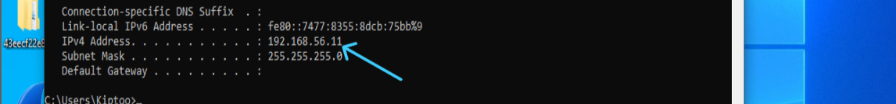
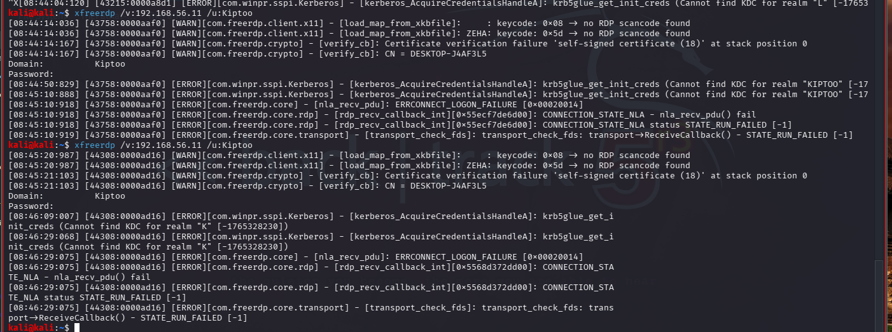
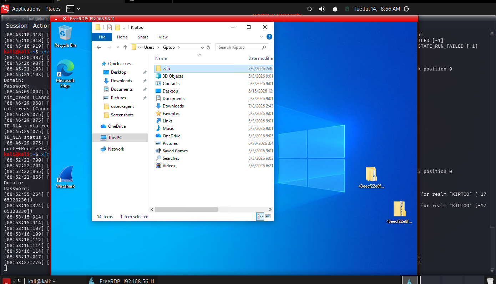
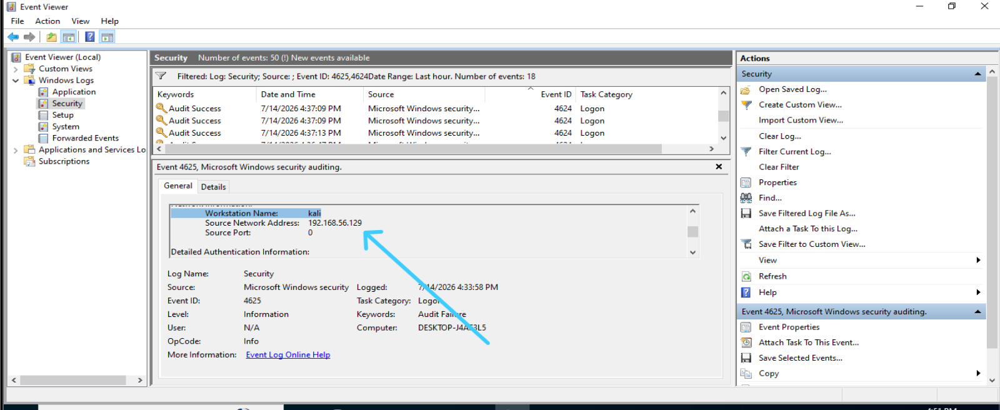

# Lab 12 – Investigating Remote Desktop Login Attempts Against a Windows 10 Host

## Scenario

The Security Operations Center (SOC) receives an alert indicating multiple Remote Desktop Protocol (RDP) authentication attempts against a Windows 10 workstation. As a Tier 1 SOC Analyst, your task is to investigate the authentication events, determine whether they represent normal user behavior or a potential brute-force attack, and document your findings.

## Objectives

Enable Remote Desktop on Windows.

Connect from Kali using xfreerdp.

Generate both failed and successful RDP logins.

Investigate Windows Security Event Logs.

Identify the source IP, targeted account, logon type, and outcome.

Document findings in a SOC-style report.

## Phase 1 — Prepare the Environment

 Verify IP Addresses

#### Windows

```cmd
ipconfig
```


ip addr: 192.168.56.11

#### kali

```bash
ip a
```


ip addr: 192.168.56.129

## Environment

| Machine    | Operating System | IP Address    | Role          |
| ---------- | ---------------- | ------------- | ------------- |
| Kali Linux | Kali Linux       | 192.168.56.129 | Remote Client |
| Windows 10 | Windows 10 Pro   | 192.168.56.11 | Target        |

## Phase 2 — Verify Port 3389 (listening RDP port)

From kali

```bash
nmap -Pn -p 3389 192.168.56.11
```


### Observation

Nmap confirmed that TCP port 3389 was open, indicating that the Windows Remote Desktop service was accessible from the Kali Linux workstation.

## Phase 3 — Connect using RDP

verify xfreerdp if installed and version update if outdated

```bash
xfreerdp /version
```
installed 

## Phase 4 — Generate Failed Logins from attacker machine

```
xfreerdp /v:192.168.56.11 /u:Kiptoo
```
Enough to generate meaningful log entries without triggering unnecessary account lockouts (if configured).



View from the attackers machine (kali linux) failed connection to the windows machine

## Phase 5 — Successful Login

```
xfreerdp /v:192.168.56.11 /u:Kiptoo
```


Successful RDP session.

## Phase 6 — Event Viewer Investigation

On Windows open:

Eventviewer - windows logs -security



Filter log :

- 4625 -   Failed Login  (logon type 2)
- 4624 -   Successful Login (logon type 3)

## Observation

During testing, failed authentication attempts were recorded as Logon Type 3 (Network), while the successful session was recorded as Logon Type 2 (Interactive). The events were correlated using their timestamps, the target account, and the successful RDP connection from the Kali Linux host. This demonstrates that multiple authentication-related events can be generated during a remote desktop session, and analysts should validate findings using multiple event fields rather than relying solely on the logon type.

## Investigation

For each event record:

- Time Created          
- Event ID              
- Target Account        
- Logon Type          
- Source Network Address 
- Failure Reason         
- Status               
- Authentication Package

 ## Phase 7 — Build the Timeline

Reconstructing an authentication incident.

| Time  | Event            |
| ----- | ---------------- |
| 16:33 | Failed Login     |
| 16:33 | Failed Login     |
| 16:34 | Failed Login     |
| 16:35 | Successful Login |

## Analysis

The investigation identified multiple failed Remote Desktop authentication attempts originating from the Kali Linux workstation (192.168.56.129). Windows Security logs recorded Event ID 4625 for each failed login and Event ID 4624 after valid credentials were provided. The observed Logon Type indicated a remote interactive session, consistent with RDP authentication. Although this activity was generated intentionally within a controlled lab environment, a similar sequence in production—multiple failures followed by a successful login—could indicate password guessing or brute-force activity and would warrant further investigation.

## Conclusion

This lab simulated and investigated Remote Desktop (RDP) authentication attempts against a Windows 10 host from a Kali Linux machine. By analyzing Windows Security logs, I identified and correlated successful and failed login events with the remote connection activity. The exercise strengthened my understanding of Windows authentication logging, remote access monitoring, and the importance of correlating multiple event fields to accurately investigate authentication-related incidents in a SOC environment.

## Lessons Learned

- RDP uses TCP port 3389 and provides graphical remote access to Windows systems.
- Windows Security logs are an important source of evidence for authentication investigations.
- Event IDs such as 4624 (successful logon) and 4625 (failed logon) help analysts reconstruct login activity.
- Authentication events should be interpreted using a combination of:
  - Event ID
  - Timestamp
  - Account name
  - Logon type
  - Source network address
  - Authentication package
- Real-world investigations often require correlating multiple log sources rather than depending on a single event.
- Expected event patterns can differ depending on Windows version, authentication method (such as Network Level Authentication), and system configuration.

## Skills Demonstrated

- Remote Administration
 <!-- 
Configured and enabled Remote Desktop on Windows.

Established remote desktop connectivity from Kali Linux using xfreerdp.

Verified RDP service availability with Nmap.
-->
- Windows Security Monitoring
 <!-- 
Investigated Windows Security Event Logs.

Filtered authentication events using Event Viewer.

Identified successful and failed authentication records.

Interpreted authentication-related event fields.
-->
- Network Analysis
 <!-- 
Confirmed RDP accessibility over TCP port 3389.

Validated communication between Kali Linux and the Windows target.

Correlated network activity with host-based authentication events.
 -->
- Incident Investigation
<!-- 
Simulated a controlled authentication incident.

Distinguished between failed and successful login attempts.

Built an authentication timeline.
-->
- Documentation
 <!-- 
Produced a repeatable security lab.

Documented objectives, methodology, observations, analysis, and conclusions.

Presented findings in a format suitable for a professional 
-->

