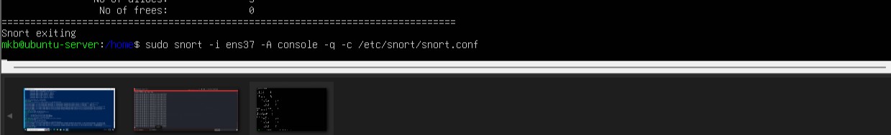
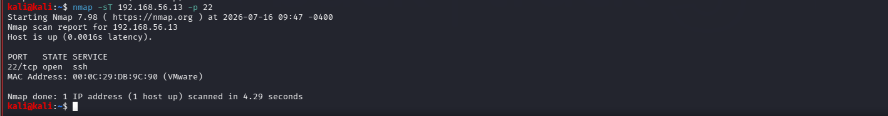
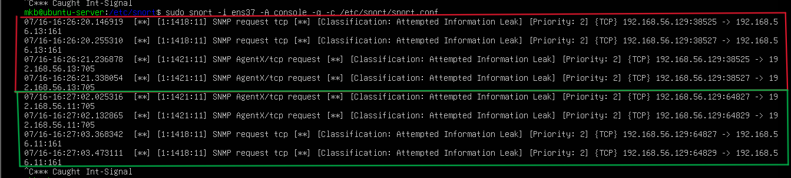
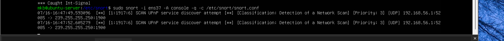

# Lab 13 – Snort IDS Alert Analysis

## Objectives

Learn how Snort IDS detects suspicious network activity and generates alerts in real time.

## Lab Topology

                Host-Only Network (192.168.56.0/24)

        Kali Linux                 Ubuntu Server                  Windows 10
      (192.168.56.129)            (192.168.56.13)              (192.168.56.11)

        Attacker  --------------->  Snort IDS  <------------------  Victim

 Roles

Kali = Attacker
Ubuntu = IDS (Snort)
Windows = Target machine 

## Objectives

- Install Snort if not installed
- Configure Snort
- Monitor network traffic
- Detect suspicious traffic
- Investigate generated alerts

## Step 1 — Verify Snort

```bash
snort -V
```


## Step 2 — Verify Configuration

```bash
sudo snort -T -c /etc/snort/snort.conf
```
-T - Test mode

-c - Configuration file path

The command ensures Snort  load your configuration, check for any syntax errors or missing files, print a success or error message, and then exit


Configuration loads successfully

Rules load successfully

## Step 3 — Start Snort

run:

```
sudo snort -i ens37 -A console -q -c /etc/snort/snort.conf
```
-A - Alert mode

-q - quite mode

This command runs Snort as a live Network Intrusion Detection System (NIDS) to actively capture and analyze network traffic accordng to Network interface selected 'ens37' (my network 192.168.56.0/24) 

NB-Dont close this terminal 



## Step 4 — Generate simple Traffic

Open Kali

Perfom half tcp scan (multiple devices on the network)

```
nmap -sS 192.168.56.13
nmap -sS 192.168.56.11
```

## Step 5 — Observe Snort

Watch the Snort terminal.

Possible outcomes:


TCP scan

```
nmao -sT 192.168.56.13 -p 22
```


### Case 1

Snort generates alerts.

Document:

- Alert message
- Source IP
- Destination IP
-  Protocol
- Timestamp

### Case 2

No alerts appear.

This is normal. It simply means the default rules did not match the traffic thus, We'll create our own detection rule.

 ## Step 6 — Investigate Alerts
 
 half scan on multiple device (192.168.56.11, 192.168.56.13)

 

 TCP full scan
 

If alerts are generated, identify:

1.Which IP initiated the traffic?
2.Which host received it?
3.Which protocol?
4.Which port?
5.Which Snort rule triggered?

### Expected Skills


Installing an IDS
Configuring Snort
Monitoring live network traffic
Running reconnaissance attacks
Analyzing IDS alerts

  
