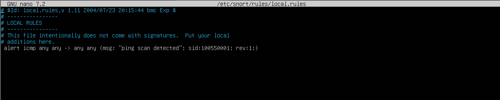
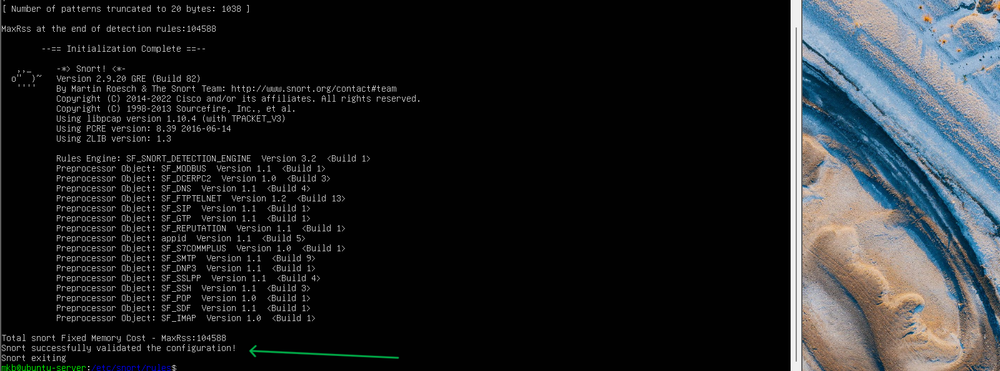
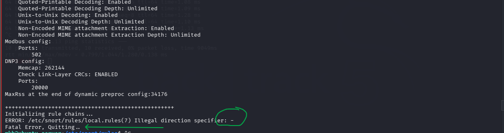
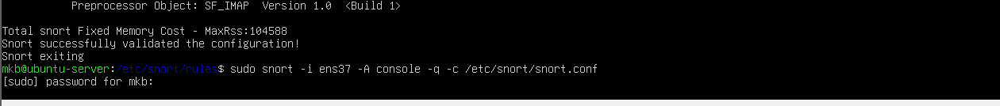
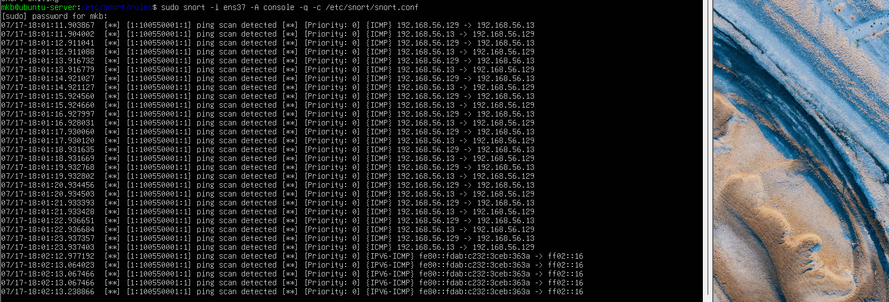

# Lab 14 – Snort IDS Custom Rule Creation and Alert Analysis

## Objective

Learn how to create, validate, troubleshoot, and deploy custom Snort IDS rules to detect specific network activity and generate real-time alerts.

## Tools Used

Ubuntu Server

Snort IDS

Kali Linux

Nano

Ping

Linux Terminal

## Objectives

- Understand Snort rule syntax.
- Create custom IDS rules.
- Validate Snort configurations.
- Troubleshoot syntax errors.
- Detect custom alert traffic.
- Analyze generated alerts.

##  Step 1 – Create a Custom Rule

Open the local rules file:

we use nano file editor with root access

```
sudo nano /etc/snort/rules/local.rules
```

Add a custom rule different to the rules already available for our case les create a ICMP  ping scan alert rule
NB: Use double quatations for the alert message 

```
alert icmp any any - > any any (msg:"Ping scan detected"; sid:100550001; rev:1;)
```



Breakdown:

- alert   - Generate alert
- icmp    - Inspects ICMP packets
- any any - any source ip and port
- ->      - Traffic direction
- any any - any destination ip and port
- msg     - alert message
- sid     - snort unique id
- rev     - Rule revision

## Step 2 – Validate Configuration

Run

```bash
sudo snort -T -c /etc/snort/snort.conf
```

Expected output:
```
Snort successfully validated the configuration!
```


During validation when you observe "Fatal Error, Quitting..." the rule might contain invalid operator



In my case we can identify and analyze the error

```
ERROR: /etc/snort/rules/local.rules(7) Illegal direction specifier: -
Fatal Error, Quitting..
```
### Cause

The custom rule contained an invalid direction operator. (- instead of - >)

After correcting the rule syntax  the configuration validated successfully, Therefore, small syntax mistakes can prevent IDS from alert generation meaning you can't receive logs for the alert

## Step 3 – Start Snort

```
sudo snort -i ens37 -A console -q -c /etc/snort/snort.conf 
```



Replace 'ens37' with your network interface

## Step 4 – Generate Traffic

From Kali:

```
ping 192.168.56.13
```


## Step 5 – Observe Alerts

Snort generates an ICMP alerts, This confirms the custom rule matched the ICMP traffic.



## Conclusion

This lab demonstrated how to create, validate, and troubleshoot custom Snort IDS rules. A custom ICMP detection rule was successfully deployed after resolving a syntax error, highlighting the importance of configuration validation and attention to detail. The exercise strengthened practical skills in intrusion detection, rule development, and IDS troubleshooting.

## Key Takeaways

- Snort detects traffic based on user-defined rules.
- Every rule must follow the correct syntax.
- The sid uniquely identifies a rule.
- The msg option provides meaningful alert descriptions.
- The -> operator defines packet direction.
- snort -T should always be used to validate configuration changes before running Snort.

## Skills Demonstrated
- Snort IDS deployment
- Custom rule creation
- Linux configuration management
- Rule syntax validation
- Network traffic monitoring
- IDS alert analysis
- Troubleshooting and debugging
- Even a single syntax error can prevent Snort from starting.
