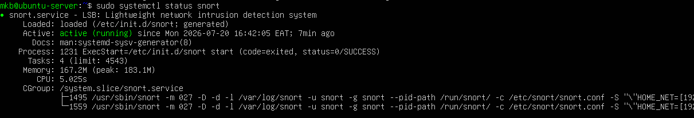
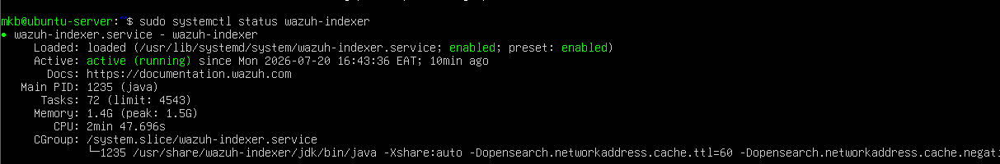
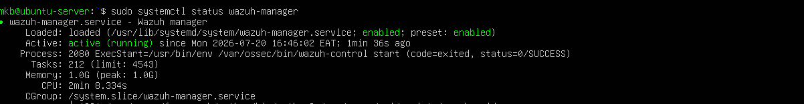
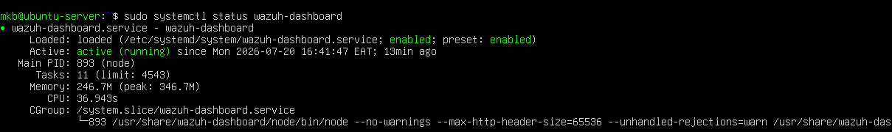
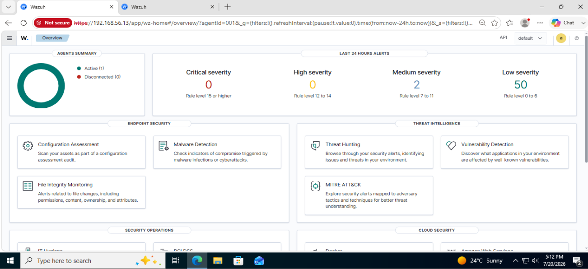
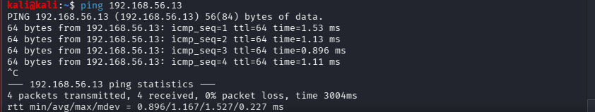
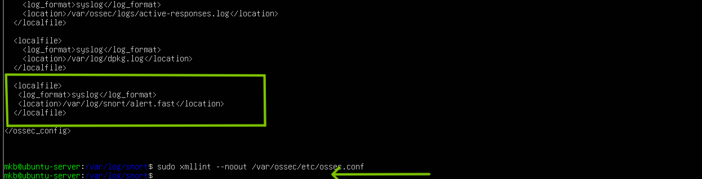
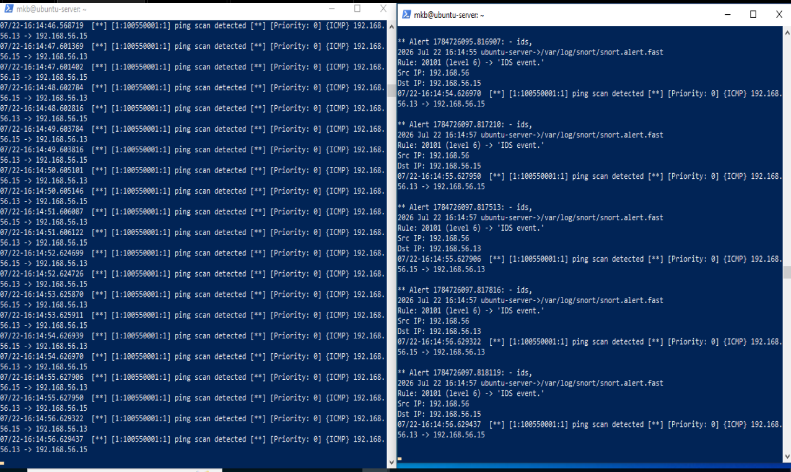
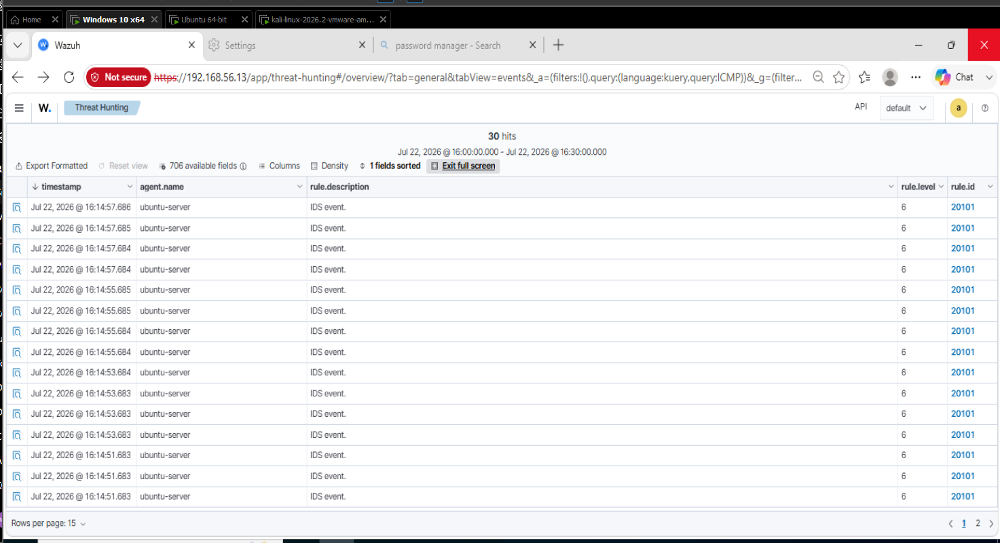

# Lab 15 – Integrating Snort IDS with Wazuh SIEM

## Objective

Integrate Snort IDS with the Wazuh SIEM to centralize intrusion detection alerts, monitor them through the Wazuh Dashboard, and validate that security events are successfully collected and analyzed.

## Lab Environment

## Part 1 – Verify the Existing Environment

| Component     | Role                      | IP Address    |
| ------------- | ------------------------- | ------------- |
| Kali Linux    | Attacker                  | 192.168.56.15 |
| Ubuntu Server | Wazuh Manager + Snort IDS | 192.168.56.13 |
| Windows 10    | Victim Machine            | 192.168.56.11 |

### Prerequisites

- Snort installed and configured.
- Wazuh Manager installed.
- Wazuh Dashboard accessible.
- Kali Linux connected to the same network.
- Local Snort rules configured.


## Objective

Confirm that both Snort IDS and Wazuh SIEM are installed, running, and functioning independently before integration.

## Step1 - Verify services running

- Verify Snort service is running.

  
  
- Verify Wazuh  is running.
  
  
  
  
  
-  Verify Wazuh Dashboard is accessible from agent device (windows).

 
  
-  Verify kali can communicate with ubuntu server.

  

  ## Step 2 - Configure Wazuh to Monitor Snort Logs
  
  Edit the Wazuh XML configuration and Add the Snort log path (var/log/snort/snort.alert.fast) inside <ossec_config>
```
sudo nano /var/ossec/etc/ossec.conf
```
Validate the XML.
```
sudo xmllint --noout /var/ossec/etc/ossec.conf
```

Expected output
```
(no output)
```


Restart Wazuh.
```
sudo systemctl restart wazuh-manager
```
Verify:

```
sudo systemctl status wazuh-manager
```


## Step 3 - Generate Test Traffic

Generate network traffic from the Kali Linux attacker machine to trigger Snort IDS rules and produce security alerts for Wazuh to ingest.

### Verify Snort is Monitoring
```
sudo snort -A fast -q -c /etc/snort/snort.conf -i ens37
```
Generate ICMP Traffic

From the Kali Linux machine execute:
```
ping 192.168.56.13
```
Monitor the Snort alert log
```
sudo tail -f /var/log/snort/snort.alert.fast
```
### Verify Wazuh Receives Snort Alerts

Monitor the Wazuh alert log.
```
sudo tail -f /var/ossec/logs/alerts/alerts.fast
```
Snort and Wazuh logs generation against ICMP custom rule generated in the previous lab accessed remotely from powershell



## Step 4 – Validate Alerts in the Wazuh Dashboard

Confirm that Snort IDS alerts are visible and searchable through the Wazuh Dashboard.

Navigate to
```
Threat Hunting
```
and instect each document detail



The dashboard displays:

- Event timestamp
- Source IP
- Destination IP
- Alert message
- Snort SID
- Severity level
- 
##  Step 7 – Alert Investigation

Objective

Investigate the captured alert using Wazuh.

Review the following fields:

| Field          | Description             |
| -------------- | ----------------------- |
| Timestamp      | Time the alert occurred |
| Source IP      | Kali Linux attacker     |
| Destination IP | Ubuntu Server           |
| Protocol       | ICMP                    |
| Snort SID      | 100550001               |
| Rule Message   | ICMP Ping Detected      |
| Decoder        | Snort                   |


## Conclusion

This lab successfully integrated Snort IDS with the Wazuh SIEM, enabling centralized monitoring of intrusion detection events. After configuring Wazuh to monitor the Snort alert log, validating the XML configuration, and restarting the Wazuh Manager, test traffic generated from the Kali Linux attacker machine triggered Snort alerts that were successfully collected and displayed in the Wazuh Dashboard.

## Key Takeaways
- Integrating an Intrusion Detection System (IDS) with a Security Information and Event Management (SIEM) platform enables centralized monitoring and analysis of security events.
- Proper log collection and configuration are essential for successful communication between security tools.
- Validating configuration files before restarting services helps prevent service failures and reduces troubleshooting time.
- Continuous monitoring of security logs provides greater visibility into network activity and potential threats.
- Generating controlled attack traffic is an effective method for verifying IDS detection capabilities and SIEM event ingestion.
- Accurate log file paths and supported log formats are critical for successful log collection and event processing.
- Structured troubleshooting is essential when integrating multiple security technologies, as issues may originate from configuration, logging, permissions, or service status.
- Centralized dashboards improve incident visibility by consolidating security alerts from multiple sources into a single interface.
- End-to-end validation—from attack generation to alert visualization—helps ensure that the monitoring pipeline is functioning correctly.

## Skills Covered
- Intrusion Detection System (IDS) configuration and monitoring
- Security Information and Event Management (SIEM) administration
- Linux system administration
- Log collection and analysis
- Security event monitoring
- Network traffic analysis
- Service management and troubleshooting
- Security tool integration
- Incident investigation and validation
- Technical documentation and reporting
