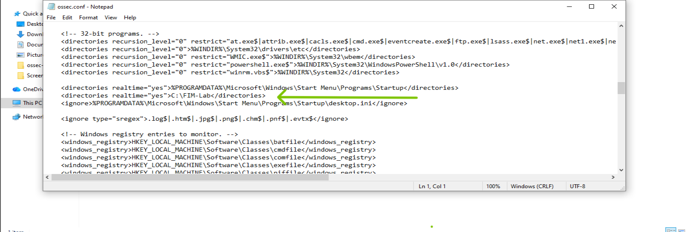
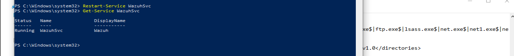
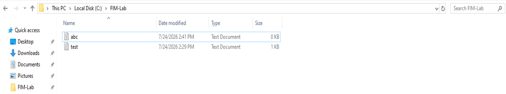
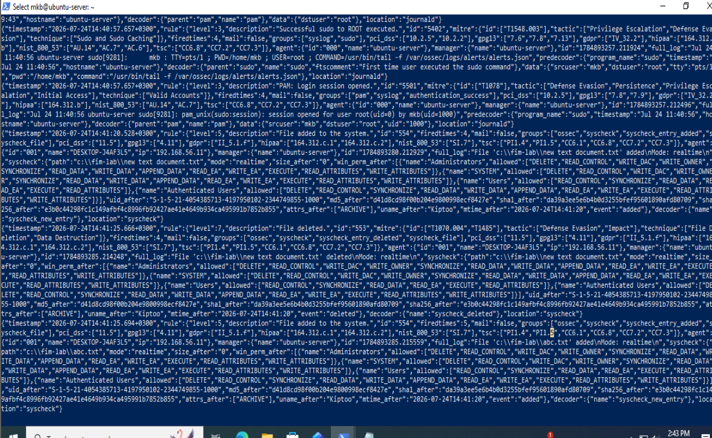
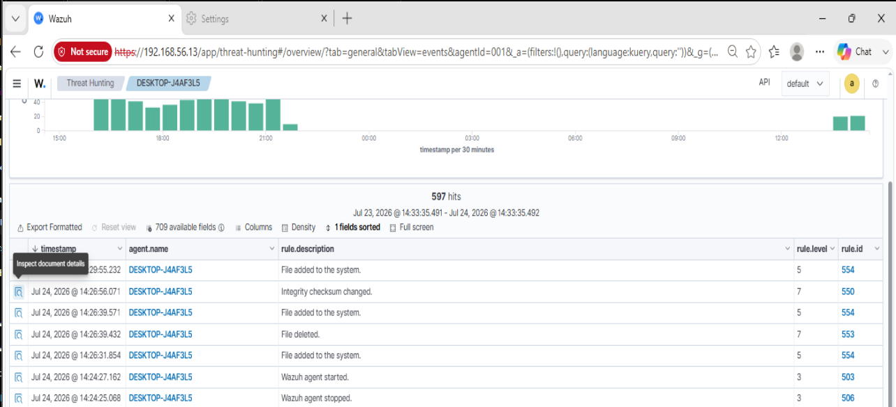
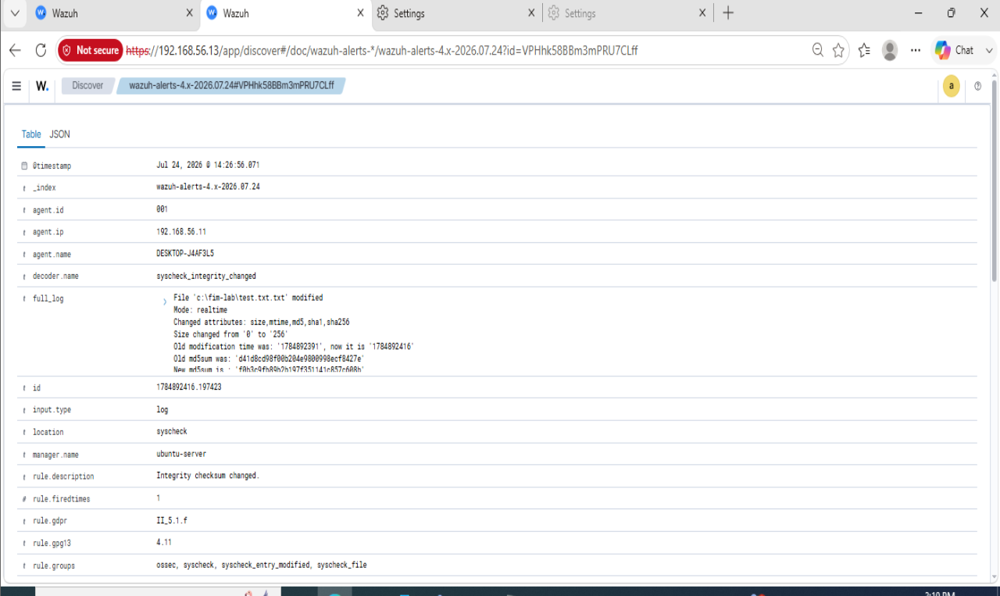

# Lab 16 - File Integrity Monitoring (FIM) with Wazuh

## Objective

Configure Wazuh File Integrity Monitoring (FIM) on a Windows endpoint to detect file creation, modification, renaming, and deletion events, then investigate the resulting alerts in the Wazuh Dashboard.

## Prerequisites

Before starting this lab, ensure the following:

- Wazuh Manager is installed and operational on Ubuntu Server.
- Wazuh Dashboard is accessible.
- Windows 10 endpoint is enrolled and active as a Wazuh agent.
- Communication between the Wazuh Manager and Windows agent is functioning.

 ## Step 1 – Configure File Integrity Monitoring

 By default, Wazuh monitors several critical Windows directories. For this lab, we will create and monitor a dedicated directory/folder to generate controlled file integrity events.

### Procedure

Create a new directory on the Windows endpoint from cmd or powershell:

```cmd
mkdir C:\FIM-Lab
```
or you can open using file explorer and create FIM-lab folder on local disk C

Navigate to the Wazuh agent configuration file on windows

```
C:\Program Files (x86)\ossec-agent\ossec.conf
```
Locate the <syscheck> (system check) section and add the following line: And since we are editing inside program files we need administrator privilleges open notepad as Administrator

```
<directories realtime="yes">C:\FIM-Lab</directories>
```
We are telling wazuh to monitor directory FIM-Lab  (which we recently created for our lab demo) in real time



## Step 2 – Restart the Wazuh Agent

Open PowerShell as Administrator and restart the agent:

```
Restart-Service WazuhSvc
```
Verify that the service is running:
```
Get-Service WazuhSvc
```
Expect
```
Status : Running
```


## Step 3 – Generate File Integrity Events

Lets generate file system changes on the monitored endpoint and see if Wazuh records each event

### Scenario

An attacker or insider may create, modify, rename, or delete files on a system. File Integrity Monitoring (FIM) helps detect these actions and alerts security analysts to potential unauthorized activity.

### 1 – File Creation

Open Notepad and create a file: 

```
C:\FIM-Lab\test.txt
```
Lets create 'test.txt' and 'abc.txt' file, add contents and save


```
test.txt
abc.txt
```


From wazuh logs



From screenshot, you can see Wazuh generating Syscheck (FIM) alerts.

identify these events:

✅ Rule ID 554 — "File added to the system."

✅ Rule ID 553 — "File deleted."

✅ Another Rule ID 554 — File added (abc.txt)

you can also see:
```
Agent: DESKTOP-J4AF3L5

Path: C:\fim-lab\new text document.txt

Mode: realtime

Decoder: syscheck_new_entry

Groups: syscheck
```
This means:

✅ Wazuh Agent is monitoring the folder.

✅ Real-time FIM is working.

✅ Alerts are reaching the Wazuh Manager.

✅ Your lab configuration is successful.

## Step 4 – Investigating FIM Alerts in the Wazuh Dashboard

Open the Wazuh Dashboard.

Go to:
```
Threat Hunting
```
You should now see the same alerts that appeared in alerts.json logs.



Expand details to analyse info



Record the crucial information from the analysis of the details i.e

For the File Added event:

| Field           | Value                    |
| --------------- | ------------------------ |
| Rule ID         | 554                      |
| Description     | File added to the system |
| Agent           | DESKTOP-J4AF3L5          |
| File            | `abc.txt`                |
| Event           | Added                    |
| Monitoring Mode | Realtime                 |

For the File Deleted event: 

| Field       | Value                   |
| ----------- | ----------------------- |
| Rule ID     | 553                     |
| Description | File deleted            |
| Agent       | DESKTOP-J4AF3L5         |
| File        | `new text document.txt` |
| Event       | Deleted                 |

For the File modified event:

| Field       | Value                   |
| ----------- | ----------------------- |
| Rule ID     | 550                     |
| Description | Integrity checksum changed  |
| Agent       | DESKTOP-J4AF3L5         |
| File        | `test.txt.txt`          |
| Event       | Modified                 |

we can see rule-id 

-550- Modified file content

-553- delete file

-554- Add file

## Conclusion

In this lab, I successfully configured Wazuh File Integrity Monitoring to monitor a custom directory on a Windows endpoint. After updating the agent configuration and restarting the Wazuh service, Wazuh detected file creation and deletion events in real time and forwarded them to the Wazuh Manager. I verified these events through the manager's alerts.json log and confirmed that the Syscheck module was functioning correctly.

This lab demonstrated how File Integrity Monitoring can help security analysts detect unauthorized file system changes that may be associated with malware infections, insider threats, ransomware activity, or unauthorized configuration modifications. It also strengthened my ability to configure, validate, troubleshoot, and investigate Wazuh FIM alerts in a simulated SOC environment.

## Key Takeaways
- Successfully configured Wazuh File Integrity Monitoring (FIM) to monitor a custom directory on a Windows endpoint.
- Verified that Wazuh detects file creation and deletion events in real time using the Syscheck module.
- Learned how FIM alerts are generated by the Wazuh Agent and forwarded to the Wazuh Manager for analysis.
- Investigated file integrity events using both the Wazuh Dashboard and the alerts.json log on the Wazuh Manager.
- Improved troubleshooting skills by identifying and resolving configuration issues that initially prevented FIM events from being generated.

## Skills Practised
- Wazuh File Integrity Monitoring (FIM) configuration
- Windows Wazuh Agent configuration and management
- Editing and validating ossec.conf
- Wazuh service management and troubleshooting
- Security event monitoring and analysis
- File integrity event investigation using Syscheck
- Log analysis using alerts.json
- Threat Hunting using the Wazuh Dashboard
- Incident detection and validation through real-time file monitoring
