# Lab 17 - Windows Event Log Analysis with Wazuh(SIEM)

## Objective

The goal of this lab is to monitor and analyze Windows Security Event Logs using Wazuh SIEM. The lab demonstrates how Windows events are collected by the Wazuh agent, forwarded to the Wazuh manager, and analyzed through the Wazuh Dashboard. It focuses on investigating authentication events, user account activity, and security-related logs commonly used during SOC investigations.


## Lab Environment

| Component     | Role                 | IP Address    |
| ------------- | -------------------- | ------------- |
| Kali Linux    | Attacker Machine     | 192.168.56.15 |
| Windows 10    | Target + Wazuh Agent | 192.168.56.11 |
| Ubuntu Server | Wazuh Manager        | 192.168.56.13 |

## Step 1 – Verify Wazuh Agent Status

Before analyzing Windows logs, ensure that the Windows endpoint is actively communicating with the Wazuh Manager.

```
sudo /var/ossec/bin/agent_control -l
```
sudo - Admin mode

/var/ossec/bin/ -wazuh management binaries directory

agent_control- Wazuh management utility used to view and manage all registered agents connected to the Wazuh Manager.

-l -list

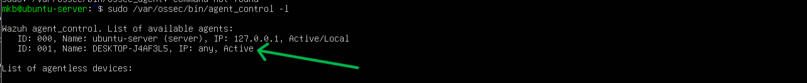

### Analysis

Windows agent is Active and is successfully communicating with the Wazuh Manager and sending logs for analysis.

## Step 2 – Verify Windows Security Events Are Being Collected

Now that the Windows Wazuh agent is active, lets confirm that Windows Security Event Logs are being forwarded to the Wazuh Manager and are visible in the Wazuh Dashboard.

Access the Wazuh Dashboard.

Filter to your active agent
```
agent.name:windows10
```
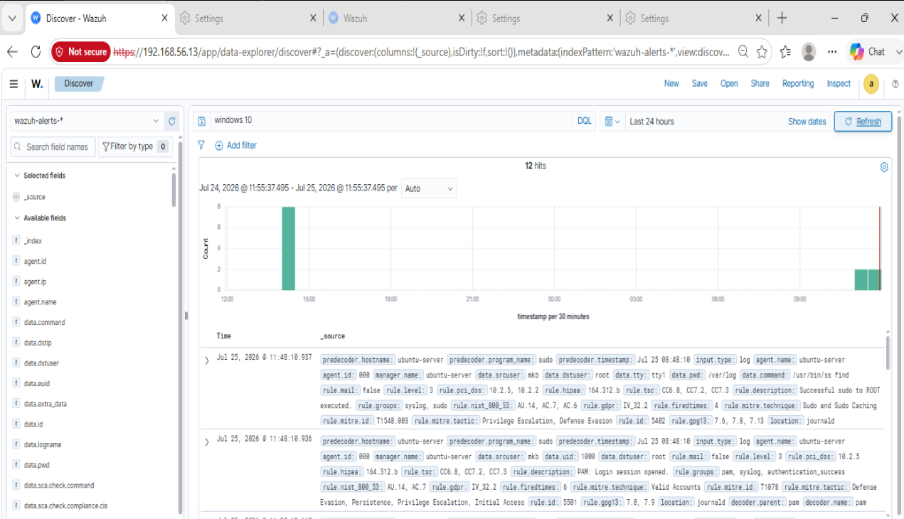

## Step 3 – Generating Windows Authentication Events (Event IDs 4624 & 4625)

The goal of this step is to generate real Windows authentication events by performing both successful and failed login attempts. These events will be collected by the Wazuh Agent, forwarded to the Wazuh Manager, and displayed in the Wazuh Dashboard for analysis.

| Event ID | Description          |
| -------- | -------------------- |
| 4624     | Successful logon     |
| 4625     | Failed logon attempt |

Lock the Windows Workstation, Generate Failed Logins then Log In Successfully

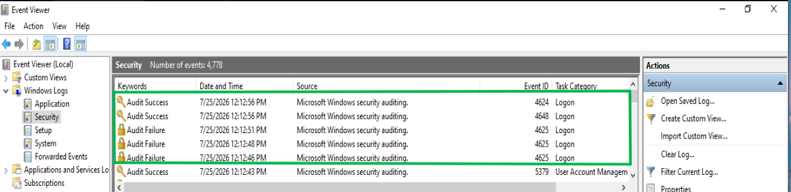

3 failed attempts one succsesful login

## Step 4 – Investigate Windows Authentication Events in Wazuh

Open the Wazuh Dashboard and search for the events:

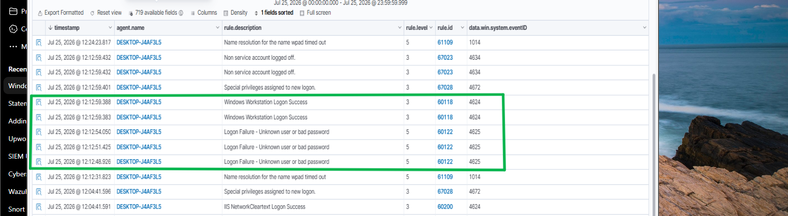

Examine the Event Details

Follow and expand the event to check event details and draw conclusion same procedure for successfull events

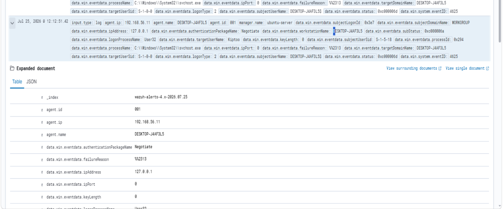

Open one of the failed login events  and identify some of the important event details i.e

| Field                  | Description                      |
| ---------------------- | -------------------------------- |
| Event ID               | 4625                             |
| Username               | Account that attempted to log in |
| Timestamp              | When the event occurred          |
| Computer Name          | The affected Windows endpoint    |
| Logon Type             | How the login was attempted      |
| Failure Reason         | Why authentication failed        |
| Authentication Package | NTLM or Kerberos                 |
| Rule Level             | Severity assigned by Wazuh       |

You can also do the same for successfull event id 4624 and view event details with same procedure

Also understand some of the important logon types

| Logon Type | Meaning                                      |
| ---------- | -------------------------------------------- |
| 2          | Interactive (user logged in at the keyboard) |
| 3          | Network login (shared folders, SMB, etc.)    |
| 5          | Service account login                        |
| 7          | Workstation unlock                           |
| 10         | Remote Desktop (RDP)                         |
| 11         | Cached credentials                           |

## Step 5 – Monitor Windows User Account Creation (Event ID 4720)

Objective

The goal of this step is to create a new local Windows user account and observe how Wazuh detects and logs the account creation event. Monitoring user account changes is critical because attackers often create new accounts to maintain persistence after compromising a system.

### Create a New User in windows

Open Command Prompt as Administrator and run:

```cmd
net user socuser Password123! /add
```
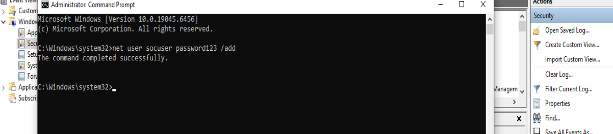

New local account created with username 'socuser' 


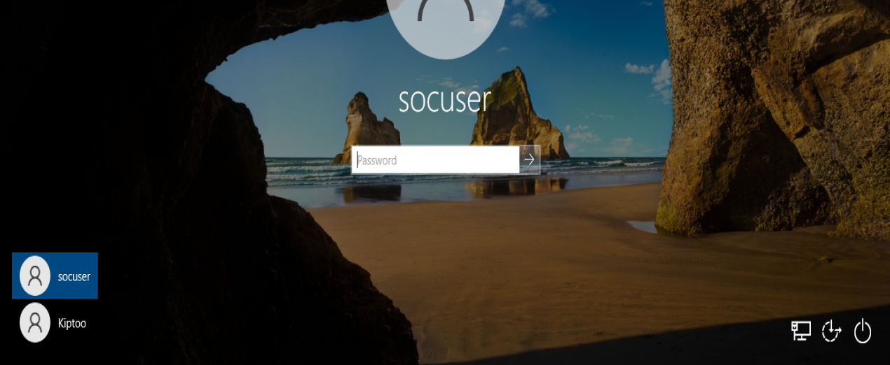

### Verify in Wazuh

Open wazuh manager dashboard and view for the event id 4720

Filter

```
4720
```

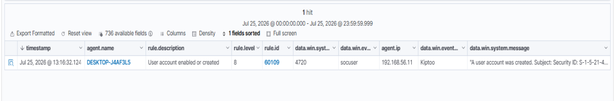

You should see an event indicating that the socuser account was created successfully.

## Step 6 – Monitor Windows User Account Deletion (Event ID 4726)

The objective of this step is to delete the user account created in the previous step and analyze the corresponding Windows Security Event in Wazuh. Monitoring account deletion is important because attackers may remove user accounts to erase evidence, disable legitimate users, or modify system access.

## open cmd (Admin)

Delete local user account from the device

Run:

```
net user socuser /delete
```
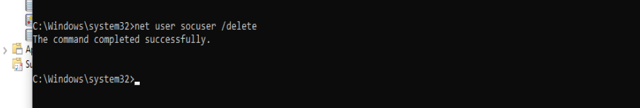

## Verify the Event in Wazuh

Filter
```
4726
```
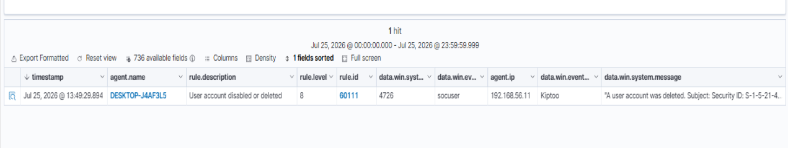

## Step 7 – Monitor Windows Process Creation (Event ID 4688)

## Objective

The objective of this step is to monitor process creation events in Windows using Wazuh. Every time a program starts, Windows can generate Event ID 4688, allowing security analysts to identify what was executed, by whom, and when.

Attackers frequently use legitimate tools such as PowerShell, Command Prompt, Windows Script Host, and other built-in utilities to execute malicious commands. Monitoring process creation helps detect this type of activity.

By default windows comes with a process creation OFF but for this lab we will enable process creation because Event-Id 4688 is only generated when enabled


If you see

```
No Auditing
```
Run on cmd

```
auditpol /set /subcategory:"Process Creation" /success:enable
```
Expected output

```
success
```
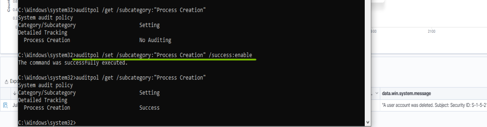


### Generate Process Creation Events

Lets launch the following applications one at a time:

- Notepad
- Calculator
- Command Prompt
- PowerShell

  ## Verify in Wazuh
  
  Filter for
  
  ```
  4688
  ```

  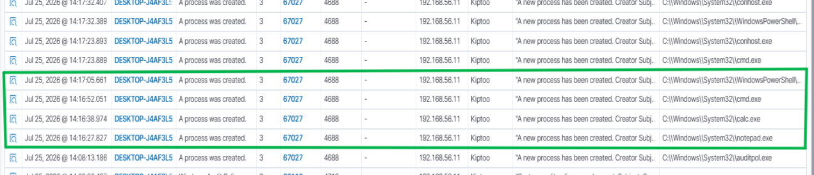

## Step 8 – Correlate Windows Security Events
  
## Objective

This step is to correlate multiple Windows Security Events to reconstruct a timeline of user activity. By examining related events together, analysts can determine whether activity is legitimate or indicative of an attack.

## Event Timeline

| Time | Event ID | Activity                                                |
| ---- | -------- | ------------------------------------------------------- |
| T1   | **4625** | Failed login attempt                                    |
| T2   | **4624** | Successful login                                        |
| T3   | **4720** | User account created (`socuser`)                        |
| T4   | **4726** | User account deleted (`socuser`)                        |
| T5   | **4688** | New process created (`cmd.exe`, `powershell.exe`, etc.) |

Now investigate the timeline and events to draw conclusions

## Conclusion

This lab demonstrated how Wazuh can be used to collect, monitor, and analyze Windows Security Event Logs in real time. By generating and investigating authentication events, user account management activities, and process creation events, I gained hands-on experience in monitoring endpoint activity and performing security investigations. Correlating multiple Windows Security Events provided valuable insight into how SOC analysts reconstruct attack timelines and identify potentially malicious behavior within a Windows environment.

## Key Takeaways

- Successfully integrated Windows Security Event Logs with Wazuh SIEM for centralized monitoring.
- Investigated successful and failed authentication events using Event IDs 4624 and 4625.
- Monitored user account creation and deletion through Event IDs 4720 and 4726.
- Enabled and analyzed Process Creation Auditing using Event ID 4688.
- Used Wazuh search filters to locate and investigate specific Windows security events.
- Correlated multiple events to reconstruct a sequence of user activity.
- Understood how Windows Event Logs support incident detection, investigation, and response in a SOC environment.
-Gained hands-on experience interpreting security-relevant Windows logs through the Wazuh Dashboard.

## Skills Demonstrated

- Windows Event Log Analysis
- Wazuh SIEM Monitoring
- Security Event Investigation
- Authentication Log Analysis
- Process Creation Monitoring
- Windows Security Monitoring
- Threat Detection & Analysis
- Incident Investigation
- Security Log Filtering
- Endpoint Security Monitoring
- SOC Alert Analysis
- Security Operations (SOC)
- SIEM-Based Threat Hunting
