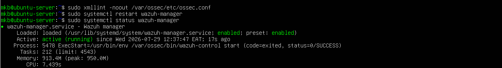

# Lab 18-Installation and configuration pf SURICATA (IDS/IPS)

## Objective

The objective of this lab is to install latest version of Suricata(IDS/IPS) and configure it to our wazuh SIEM to monitor events captured by Suricata and inspect for  malicious activity

Since we were previously using snort lets first stop and disable snort and shift to suricata

## Lab Environment

Windows 10 -Wazuh agent

Ubuntu server- SIEM centralized server

Kali-Linux- Attacker/ Packet generator

## Snort disabling

### Step 1. Check snort status

Run:
```bash
sudo systemctl status snort
```
Observational Evidence


### Step 2. Stop Snort

This stops it immediately.

```bash
sudo systemctl stop snort
```
Observational evidence


### Step 3. Disable start on boot

```bash
sudo systemctl disable snort
```
### Step 4. Remove snort log configuration from Wazuh SIEM

Open the Wazuh manager configuration using nano text editor use admin:

```bash
sudo nano /var/ossec/etc/ossec.conf
```
Find the section you previously added <localfile> , where the snort log path is '/var/log/snort/snort.alert.fast' and delete it


Delete and save the XML file, then confirm if the XML is valid 

To confirm run:

```
sudo xmllint -noout /var/ossec/etc/ossec.conf
```
It is suppose to print nothing, if it returns something thats where the error is in your file

### Restart Wazuh SIEM

```bash
sudo systemctl restart wazuh-manager
```
And confirm it's running



We've succesfully removed SNORT from our SIEM configuration but not uninstalled it lets install and configure SURICATA

## Suricata installation and configuration

### step 1. Install Suricata

On bash run:

```
sudo apt update
sudo apt install suricata -y
```
### Step 2. Verify installation

```
suricata --version
```
Confirms it's installed

Step 3. Enable on boot and Start Suricata

```
sudo systemctl enable suricata
sudo systemctl start suricata
```
Step 3. Verify its status

```
sudo systemctl status suricata
```
Evidence


Status failed lets try to identify and troubleshoot the problem using both ubuntu terminal and powershell ssh

Run
```
sudo suricata -T -c /etc/suricata/suricata.yaml -v
sudo journalctl -u suricata -n 20 --no-pager
grep "interface:" /etc/suricata/suricata.yaml
ip a
```
Issues identified

Issue 1


We'll have to download it
```
sudo update-suricata
```


Test it again
```
sudo suricata -T -c /etc/suricata/suricata.yaml
```
You should see
```
Configuration provided was successfully loaded.
```


Issue 2


We'll have to change it from default eth to ens monitoring 

My interfaces are ens33 and ens37


Let's fix to my lab
```bash
sudo nano /etc/suricata/suricata.yaml
```
Let us open and edit the configuration file to monitor my interface

Let's look for interface: eth0 replace to interface: ens37 (depends with your network interface)

 

Edit and save the interface name 

Restart Suricata and check status

```bash
sudo systemctl restart suricata
sudo systemctl status suricata
```
Evidence

