# Lab 18-Installation and configuration pf SURICATA (IDS/IPS)

## THIS LAB CONTAINS SNORT(IDS/IPS) DISABLING, SURICATA(IDS/IPS), INSTALLATION, CONFIGURATION AND TROUBLESHOOTING

## Objective

Successfully deploy Suricata Intrusion Detection System (IDS) on an Ubuntu Server by disabling the existing Snort IDS, configuring Suricata to monitor the correct network interface, installing detection rules, and troubleshooting startup failures to prepare the environment for future SIEM integration.

## Tasks Performed

- Disabled the Snort IDS service without uninstalling it.
- Removed Snort-specific log monitoring configuration from the environment.
- Installed Suricata IDS on Ubuntu Server.
- Verified the Suricata installation and service status.
- Investigated service startup failures using systemctl and journalctl.
- Identified an incorrect network interface .
- Determined the your correct network interfaces.
- Reconfigured Suricata to monitor the appropriate interface for the lab environment.
- Identified missing Suricata rule files and prepared the rule update process.
- Validated configuration using Suricata's testing utilities.

## Lab Environment

Windows 10 -Wazuh agent

Ubuntu server- SIEM centralized server


## Snort disabling

### Step 1. Check snort status

Run:
```bash
sudo systemctl status snort
```
Observational Evidence

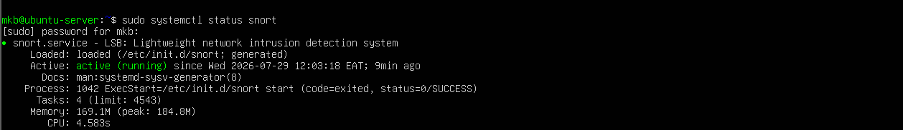

### Step 2. Stop Snort

This stops it immediately.

```bash
sudo systemctl stop snort
```
Observational evidence

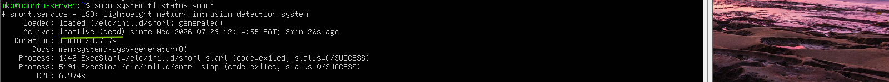

### Step 3. Disable start on boot

```bash
sudo systemctl disable snort
```
### Step 4. Remove snort log configuration from Wazuh SIEM

Open the Wazuh manager configuration using nano text editor use admin:

```bash
sudo nano /var/ossec/etc/ossec.conf
```
Find the section you previously added <localfile> , where the snort log path is '/var/log/snort/snort.alert.fast' and delete it

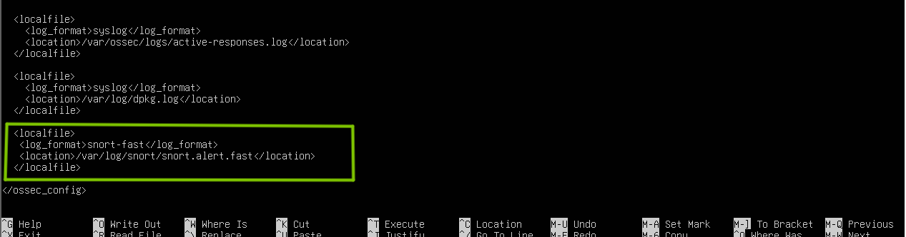

Delete and save the XML file, then confirm if the XML is valid 

To confirm run:

```
sudo xmllint -noout /var/ossec/etc/ossec.conf
```
It is suppose to print nothing, if it returns something thats where the error is in your file


We've succesfully removed SNORT from our SIEM configuration but not uninstalled it lets install and configure SURICATA

## Suricata installation and configuration

### step 1. Install Suricata

On bash run:

```
sudo apt update
sudo apt install suricata -y
```
### Step 2. Verify installation

```
suricata --version
```
Confirms it's installed

Step 3. Enable on boot and Start Suricata

```
sudo systemctl enable suricata
sudo systemctl start suricata
```
Step 3. Verify its status

```
sudo systemctl status suricata
```
Evidence

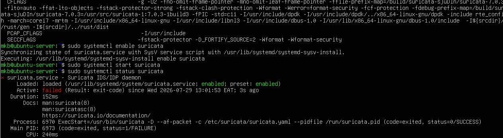

Status failed lets try to identify and troubleshoot the problem using both ubuntu terminal and powershell ssh

Run
```
sudo suricata -T -c /etc/suricata/suricata.yaml -v
sudo journalctl -u suricata -n 20 --no-pager
grep "interface:" /etc/suricata/suricata.yaml
ip a
```
Issues identified

Issue 1

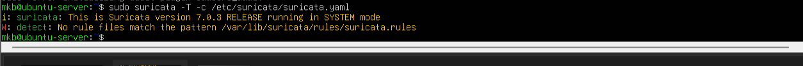

We'll have to download it
```
sudo update-suricata
```
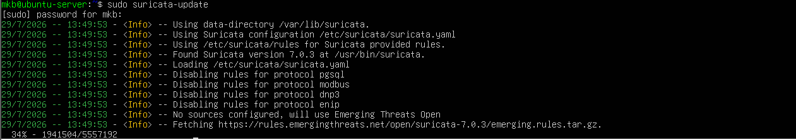

Test it again
```
sudo suricata -T -c /etc/suricata/suricata.yaml
```
You should see
```
Configuration provided was successfully loaded.
```
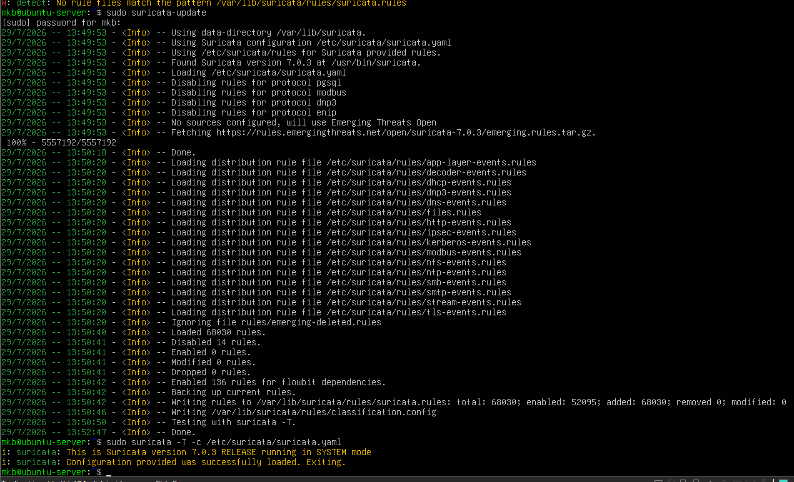

Issue 2

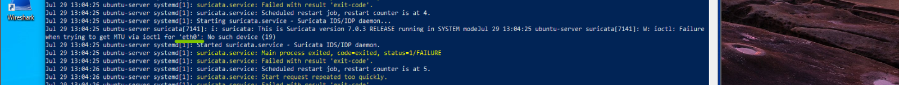

We'll have to change it from default eth to ens monitoring 

My interfaces are ens33 and ens37

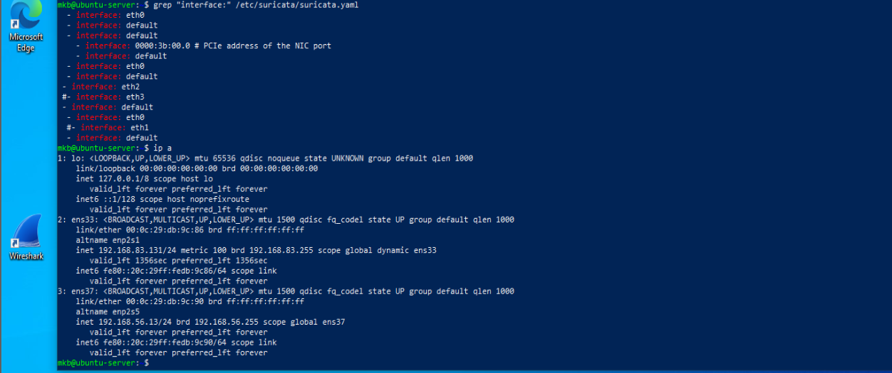

Let's fix to my lab
```bash
sudo nano /etc/suricata/suricata.yaml
```
Let us open and edit the configuration file to monitor my interface

Let's look for interface: eth0 replace to interface: ens37 (depends with your network interface)

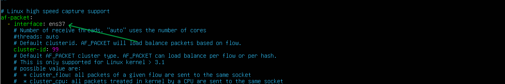 

Edit and save the interface name 

Restart Suricata and check status

```bash
sudo systemctl restart suricata
sudo systemctl status suricata
```
Evidence

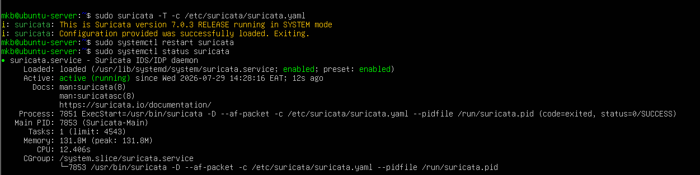

Test to see if Suricata checks in log from the network interface

Check where suricata logs in alerts
```
/var/log/suricata/fast.log
```
Lets run live packet check on the terminal

```
sudo tail -f /var/log/suricata/fast.log
```
Perfom attack on our Kali machine and see if the logs are being generated in our log collection file
Run
```
ping 192.168.56.11
nmap -sV 192.168.56.11 -A
```
Inbound data Packet sent to our network

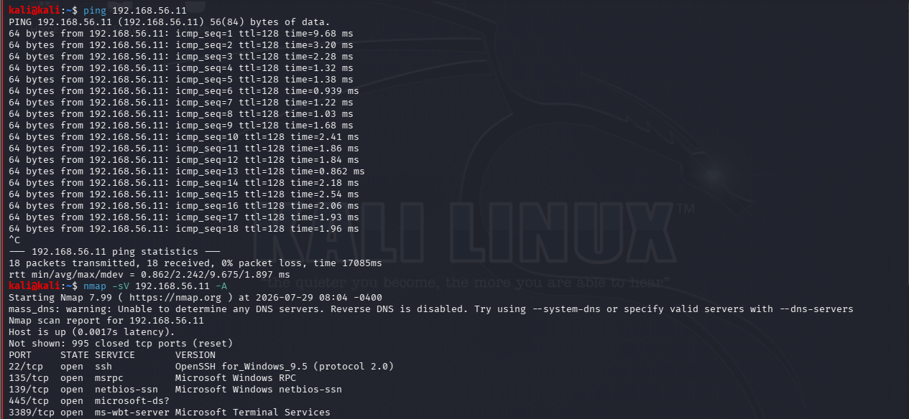

Suricata alert detection logs


or to view JSON event log
```
sudo tail -f /var/log/suricata/eve.json
```
This contains events such as:

- Alerts
- DNS
- HTTP
- TLS
- SSH
- Flow records
  This are almost same as SIEM logs we will see them later when we configure suricata alert logs to SIEM
  
  
  
## Conclusion

Successfully transitioned from Snort to Suricata by disabling the previous IDS, installing and configuring Suricata, correcting the network interface configuration, and troubleshooting service startup issues. After deployment, packet-generation tests were performed from the lab environment, and Suricata successfully processed the traffic and generated events in both /var/log/suricata/eve.json and /var/log/suricata/fast.log. This confirmed that the IDS was actively monitoring the selected interface and recording network activity in both structured JSON and human-readable alert formats.

The lab provided hands-on experience with IDS deployment, Linux troubleshooting, interface selection, rule management, log verification, and traffic validation in a virtualized SOC environment. The successful generation and observation of Suricata logs establishes a verified detection pipeline and forms a strong foundation for the next lab, which will focus on integrating Suricata with Wazuh SIEM for centralized monitoring and alert analysis.

## Key Takeaways
- Successfully deployed and configured Suricata as a network-based Intrusion Detection System on Ubuntu Server.
- Learned how to safely migrate from Snort to Suricata by disabling the existing IDS without uninstalling it.
- Understood the importance of selecting the correct network interface for effective traffic inspection.
- Gained practical experience troubleshooting IDS startup failures using Linux service and system logs.
- Learned how Suricata processes network traffic and records events in both structured (eve.json) and human-readable (fast.log) formats.
- Validated the IDS deployment by generating network traffic and confirming that Suricata successfully detected and logged events.
- Improved Linux command-line troubleshooting, configuration management, and security monitoring skills.
- Established a fully functional Suricata environment ready for integration with Wazuh SIEM in the next lab.

## Skills Demonstrated
- Intrusion Detection System (IDS) deployment
- Linux system administration
- Ubuntu Server configuration
- Suricata installation and configuration
- Network interface identification and selection
- Linux service management from (systemctl)
- Log analysis and troubleshooting from (journalctl)
- Command-line diagnostics
- IDS rule management
- JSON log analysis (eve.json)
- Alert log analysis (fast.log)
- Cybersecurity lab troubleshooting
- Network monitoring fundamentals
