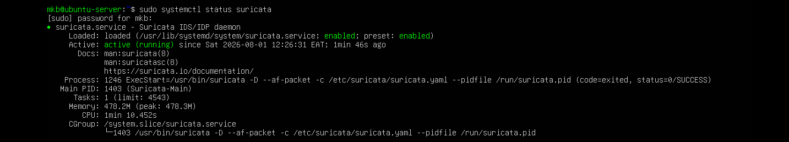
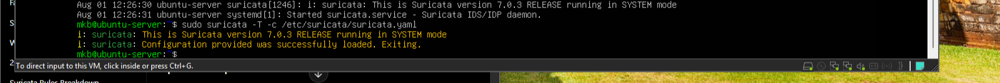
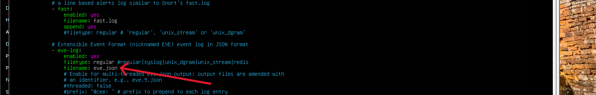
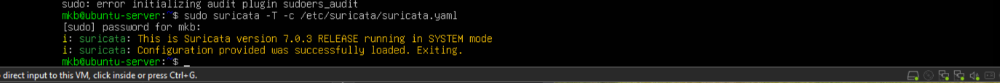
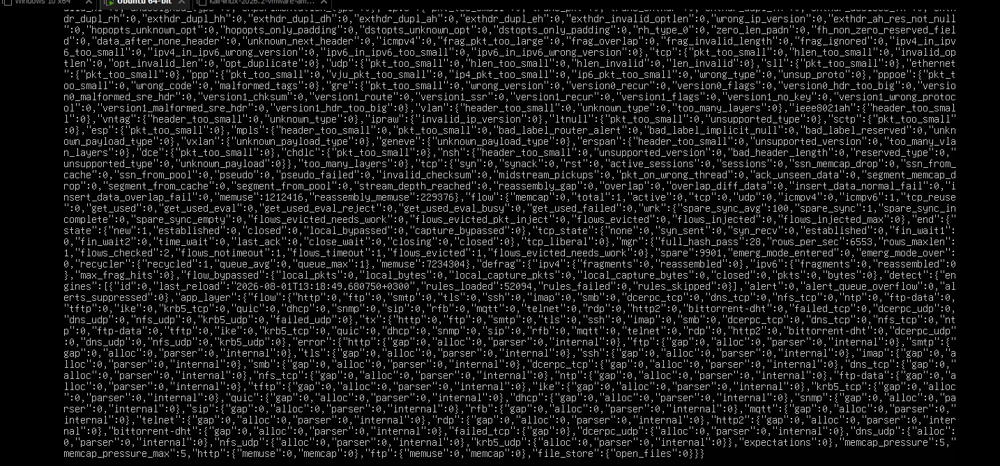
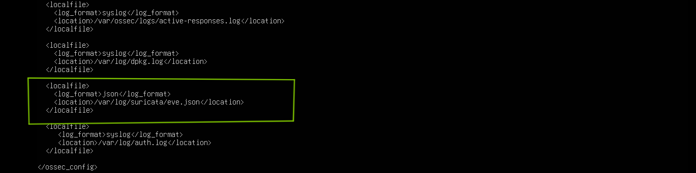
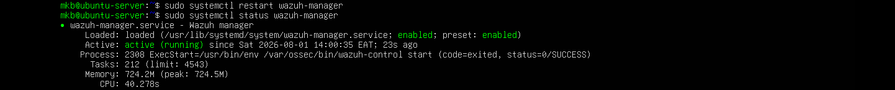

# Lab 19 - Integrating Suricata IDS with Wazuh SIEM

## Objective

Configure Suricata IDS to generate network security events and integrate those events into Wazuh SIEM for centralized monitoring, analysis, and alerting.

## Step 1: Verify the Suricata Service

Ensure that the Suricata service is running before configuring log collection.

```
sudo systemctl status suricata
```
Expected output:
```
Active: active (running)
```


#### Explanation

Wazuh can only collect Suricata events while the Suricata service is actively monitoring network traffic.

## Step 2: Validate the Suricata Configuration

Before making any changes, validate that the current Suricata configuration is free of syntax errors. This helps prevent configuration mistakes that could stop the IDS from starting.

Run:
```
sudo suricata -T -c /etc/suricata/suricata.yaml
```
## Output 


The -T option performs a configuration test without starting Suricata. It checks the syntax and verifies that the configuration file is valid.

## Step 3: Open the Configuration File

Open the Suricata configuration file to review and modify the logging configuration required for integration with Wazuh. 

NB:IF needed save a backup of the same configuration file before modification in case of any issues that may arise, this allows you to restore the file

```
sudo nano /etc/suricata/suricata.yaml
```
The suricata.yaml file controls how Suricata operates, including:

- Network interfaces 
- Detection engine settings
- Rule files
- Logging outputs
- Performance options

For the integration with Wazuh, the primary focus is enabling and configuring EVE JSON logging, which Wazuh reads to generate alerts.

Search for:
```
outputs
```
ensure eve.log file is configured with eve.json and enabled to ensure suricata generates json logs which we will use it in wazuh

 

after update and saving run test mode to ensure its a valid yaml file

```
sudo suricata -T -c /etc/suricata/suricata/yaml
```
output
```
Configuration provided was successfully loaded. Exiting.
```


## Step 4: Restart the Suricata Service and confirm its running
```
sudo systemctl restart suricata
sudo systemctl status suricata
```
Expected output:
```
Active: active (running)
```


## Step 5: Verify EVE JSON Log Generation

Confirm that Suricata is generating events in the eve.json log file
```
sudo tail -f var/log/suricata/eve.json
```
Output:



Our Suricata successfully logs in every event generated. The eve.json file is Suricata's primary structured event log. It contains detailed information about network activity, including alerts, DNS queries, HTTP requests, TLS sessions, and network flows. Wazuh will monitor this file to detect and analyze security events.

## Step 6: Configure Wazuh to Monitor eve.json

Purpose

Configure the Wazuh Manager to read Suricata's eve.json file so that network security events generated by Suricata are decoded, analyzed, and displayed in the Wazuh Dashboard.

Open the Wazuh Configuration File

Run:
```
sudo nano /var/ossec/etc/ossec.conf
```
Locate the <ossec_config> Section and add our eve.json file path as a <localfile>

Add the following <localfile> in the <ossec_config>
```
<localfile>
  <log_format>json</log_format>
  <location>/var/log/suricata/eve.json</location>
</localfile>
```
Then save



This configuration tells the Wazuh Manager to:

Monitor /var/log/suricata/eve.json 

Read events in JSON format

Apply the built-in Suricata decoders and rules to classify the events

## Step 6: Validate the Wazuh Configuration

Ensure the updated configuration contains no syntax errors before restarting the Wazuh Manager.

```
sudo /var/ossec/bin/wazuh-analysisd -t
```

## Step 7: Restart the Wazuh Manager and check status

Restart the Wazuh Manager to apply the newly added Suricata log monitoring configuration.

```
sudo systemctl restart wazuh-manager
sudo systemctl status wazuh-manager
```
Expected output
```
Active: active (running)
```
Restarting the Wazuh Manager reloads the updated ossec.conf file and begins monitoring /var/log/suricata/eve.json.

### Evidence



If the service starts successfully, Wazuh is now ready to ingest Suricata events.

## Step 8: Verify that Wazuh Is Monitoring eve.json

Confirm that Wazuh has successfully loaded the Suricata log file.

Monitor the Wazuh Log

Run:
```
sudo tail -f /var/ossec/logs/ossec.log
```
