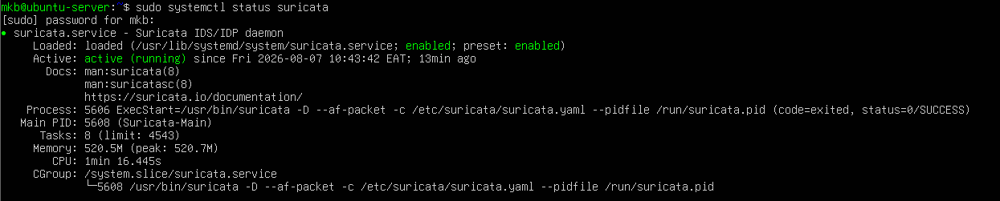
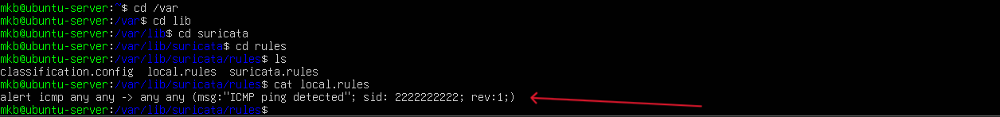
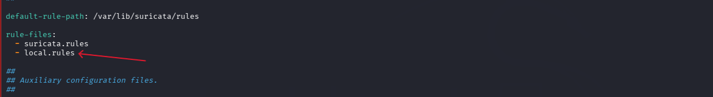
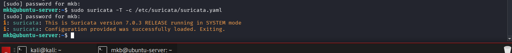
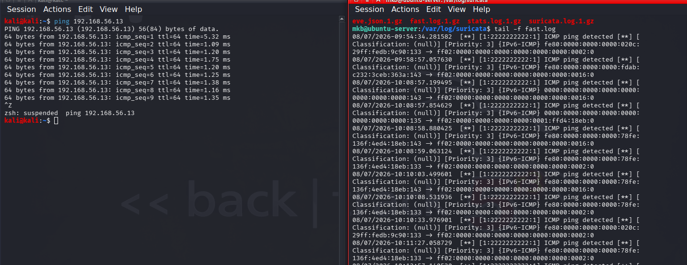
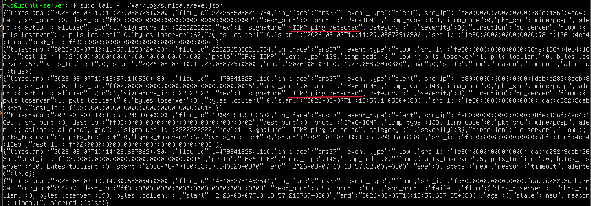
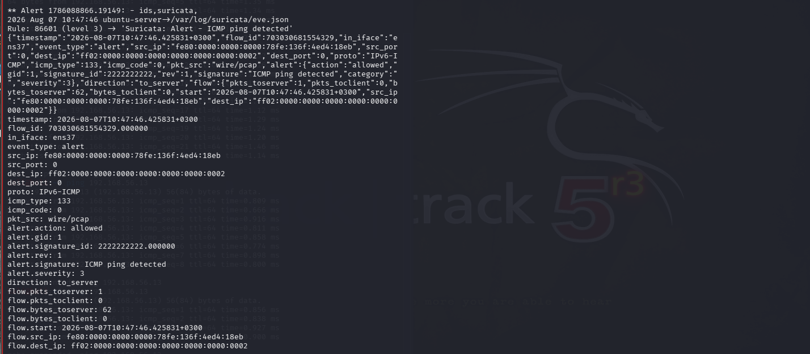
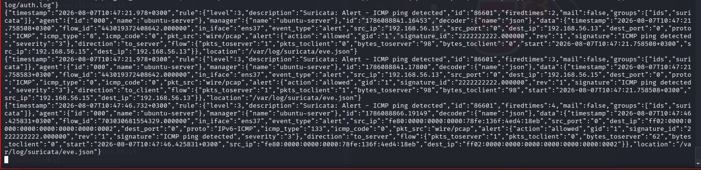

# Lab 20 - Creating and Configuring Custom IDS/IPS Alert Rule Then Viewing It in Wazuh (SIEM)

## OBJECTIVE

In this lab, we will create and configure a custom **Suricata IDS/IPS security rule**, add the rule to the Suricata configuration file, test the configuration to check for errors and validity, and then generate network traffic to trigger the custom rule.

The resulting alert will be observed in both **Suricata** and **Wazuh SIEM**, demonstrating how a custom network detection rule can be integrated into a security monitoring environment.

## Lab Components

* **Windows 10 – Victim Machine**
* **Kali Linux – Attacker Machine**
* **Ubuntu Server – Hosts Suricata & Wazuh**

## Tools Used

* **Suricata**
* **Wazuh**
* **Nano**
* **Nmap**
* **PowerShell**
* **Bash**
* **Ping/ICMP**

---

## Creating Custom Security Rule in Suricata

### Step 1: Verify Suricata

The first step is to ensure that Suricata is installed, active, and running correctly on the Ubuntu Server.

Run:

```bash
sudo systemctl status suricata
```

Observed output:



---

### Step 2: Create `local.rules` File and Write Custom Rule

We will create a `local.rules` file to store our custom Suricata detection rules.

Create the file using:

```bash
sudo nano /var/lib/suricata/rules/local.rules
```

Now we can create a simple ICMP detection rule.



The alert rule is designed to generate an alert when Suricata detects ICMP echo-request traffic originating from another machine.

This provides a simple way to verify that our custom Suricata detection rule is working correctly.

---

### Step 3: Open Suricata Configuration File and Add `local.rules` Path

After creating the custom rule, Suricata needs to be configured to load the `local.rules` file.

Open the Suricata configuration file with administrative privileges:

```bash
sudo nano /etc/suricata/suricata.yaml
```

Locate the rule path section where Suricata's rule files are defined, then add the path to the `local.rules` file that we created previously.



This ensures that Suricata loads our custom rule when the detection engine starts.

---

### Step 4: Test the Suricata Configuration

Before restarting Suricata, we need to test the configuration file to verify that it is valid and free from configuration or rule errors.

Run:

```bash
sudo suricata -T -c /etc/suricata/suricata.yaml
```

The `-T` option runs Suricata in configuration test mode and verifies that the configuration and rules can be loaded successfully.

Output:



The successful output confirms that the Suricata configuration file and custom rule were loaded successfully without errors.

---

### Step 5: Verify Alert Generation

The next step is to generate ICMP traffic from the Kali Linux attacker machine and verify whether the custom Suricata rule is triggered.

On the Kali Linux machine, generate ICMP packets by running:

```bash
ping 192.168.56.11
```

The generated ICMP traffic will be inspected by Suricata.

On the Ubuntu Server, monitor the Suricata alert logs in real time.

To monitor `fast.log`, run:

```bash
sudo tail -f /var/log/suricata/fast.log
```

To monitor `eve.json`, run:

```bash
sudo tail -f /var/log/suricata/eve.json
```

The `fast.log` file provides a concise, human-readable representation of Suricata alerts, while `eve.json` stores structured JSON events containing detailed information about the detected traffic.

#### Fast.log Alert



The alert appearing in `fast.log` confirms that the custom Suricata rule successfully matched the generated ICMP traffic.

#### Eve.json Alert



The corresponding event in `eve.json` confirms that Suricata also recorded the detection as a structured JSON event.

At this stage, the detection workflow is:

**Kali Linux → ICMP Traffic → Suricata Custom Rule → Suricata Alert**

---

### Step 6: Observe Wazuh SIEM Alert

The final step is to verify whether the Suricata alert is successfully processed by the Wazuh SIEM.

Wazuh stores generated alerts in its alert log files. Using administrative privileges, we can monitor the Wazuh alerts in real time.

To monitor `alerts.log`, run:

```bash
sudo tail -f /var/ossec/logs/alerts/alerts.log
```

To monitor `alerts.json`, run:

```bash
sudo tail -f /var/ossec/logs/alerts/alerts.json
```

Monitoring both files allows us to verify whether the Suricata event has been successfully processed by the Wazuh manager.

#### Alerts.log



The alert appearing in `alerts.log` confirms that Wazuh successfully processed the Suricata event and generated a corresponding Wazuh alert.

#### Alerts.json



The JSON representation provides structured information about the alert and can be used by Wazuh for searching, filtering, correlation, and security analysis.

---

## Lab Result

The custom Suricata detection rule was successfully created, configured, validated, and tested.

The complete detection workflow was demonstrated:

```text
Kali Linux
     │
     │ ICMP Traffic
     ▼
Suricata Custom Rule
     │
     ├──► fast.log
     │
     └──► eve.json
              │
              ▼
         Wazuh Manager
              │
              ├──► alerts.log
              │
              └──► alerts.json
```

This lab demonstrates how a custom network detection rule can be developed in Suricata and integrated into a SIEM workflow using Wazuh.

It also demonstrates the importance of validating custom detection rules and verifying the generated security event at each stage of the security monitoring pipeline.

## Key Takeaways

* Created a custom Suricata IDS/IPS detection rule.
* Added the custom rule to the Suricata configuration.
* Validated the Suricata configuration using configuration test mode.
* Generated ICMP traffic from Kali Linux.
* Confirmed the detection in `fast.log`.
* Confirmed the structured event in `eve.json`.
* Verified that the event was processed by Wazuh.
* Confirmed the resulting Wazuh alerts in `alerts.log` and `alerts.json`.
* Demonstrated an end-to-end **network detection → SIEM alerting** workflow.

