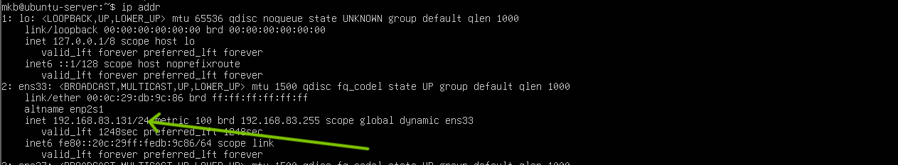
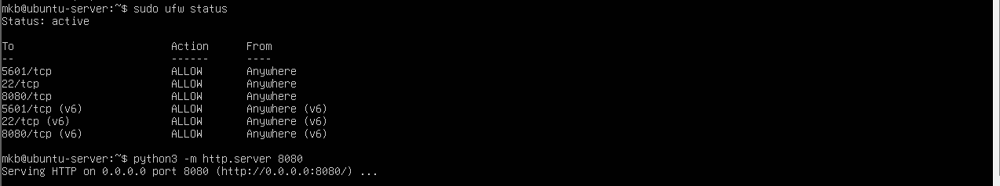
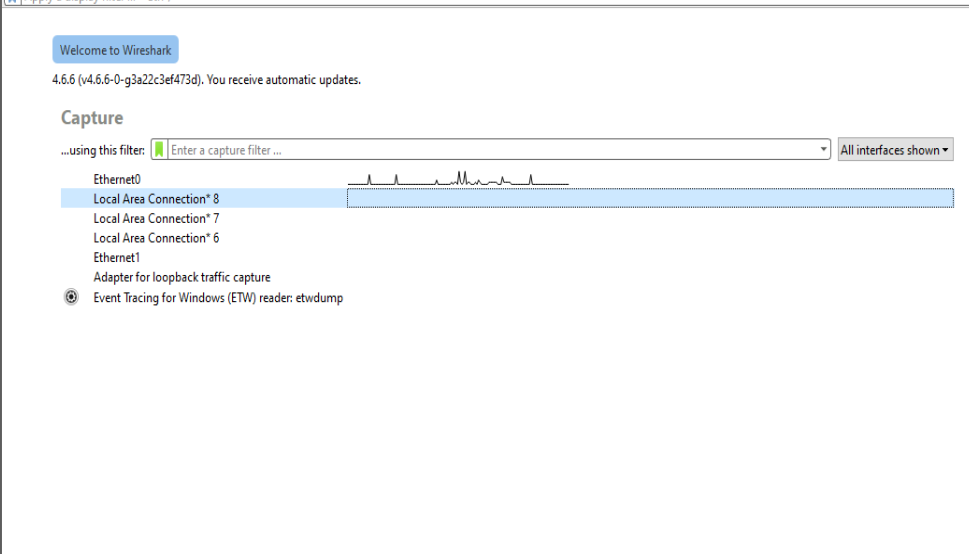
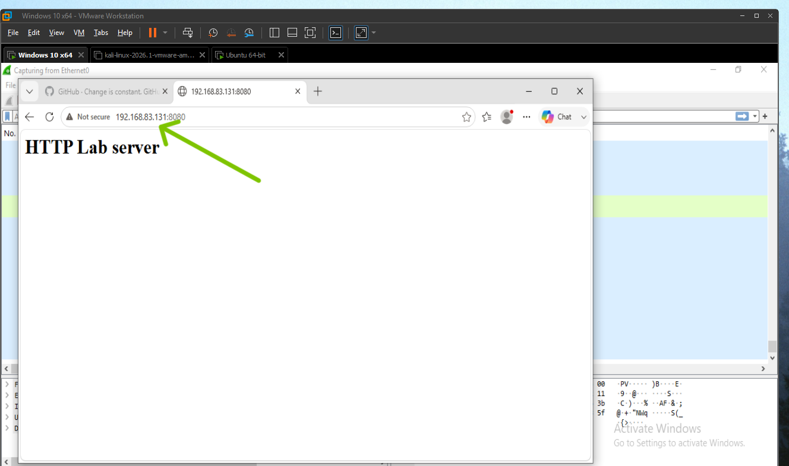
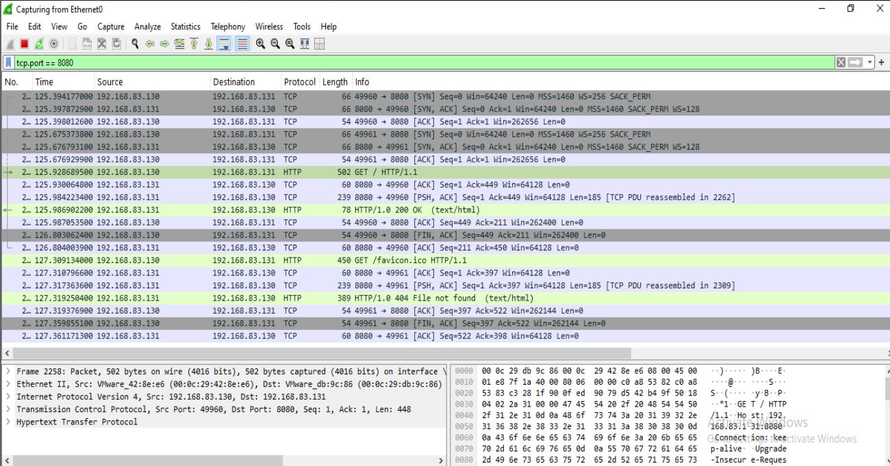
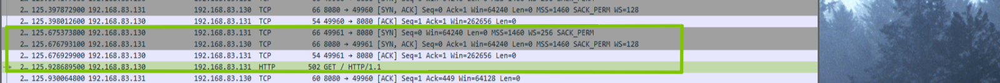
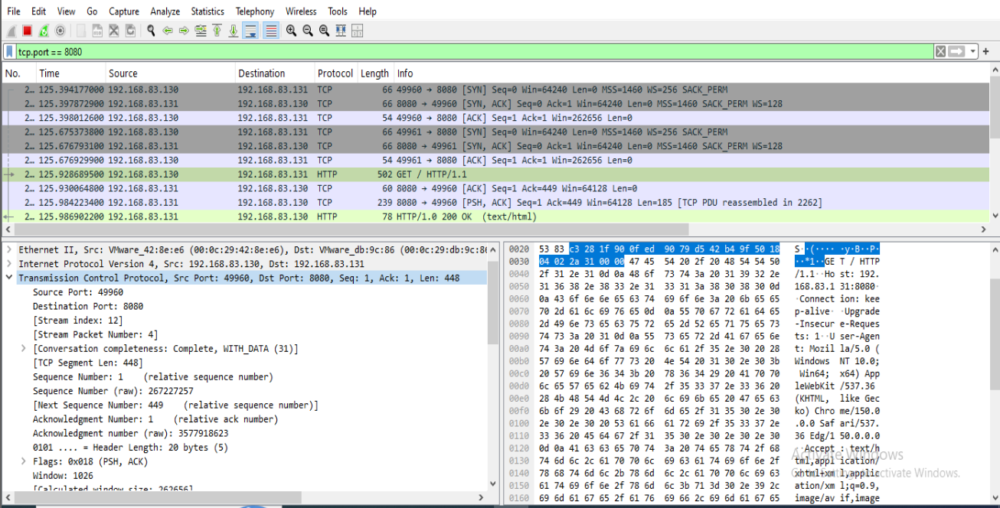
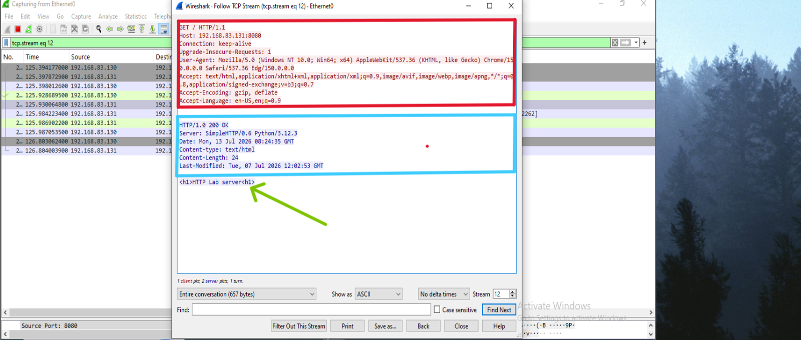
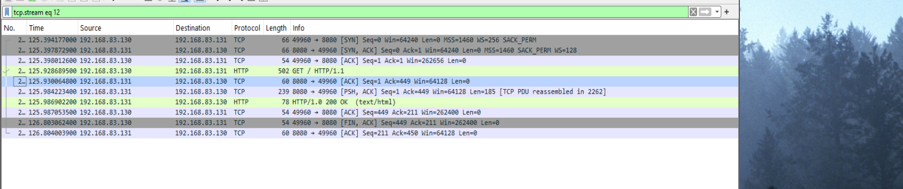

# Lab 11 – Investigating TCP Connections and the Three-Way Handshake Using Wireshark

## Scenario

The Security Operations Center (SOC) received an alert indicating that a Windows 10 workstation established a TCP connection with an internal Ubuntu web server. As a SOC analyst, you have been tasked with investigating the network traffic to determine how the connection was established, verify whether communication completed successfully, and identify any indicators of suspicious network activity.

## Objective

The objective of this investigation is to capture and analyze TCP traffic generated between a Windows 10 workstation and an Ubuntu Server hosting a Python HTTP web server. The investigation focuses on identifying the TCP three-way handshake, analyzing TCP flags, sequence and acknowledgement numbers, application-layer communication, connection termination, and retransmissions to understand normal TCP communication and establish a baseline for future threat investigations.

## Lab Environment

| Component      | Description                    |
| -------------- | ------------------------------ |
| Client         | Windows 10                     |
| Server         | Ubuntu Server                  |
| Packet Capture | Wireshark                      |
| Web Server     | Python HTTP Server             |
| Browser        | Microsoft Edge / Google Chrome |
| Network Mode   | NAT                            |
| Protocols      | TCP, HTTP                      |

## Tools Used

Wireshark

Windows Command Prompt

Ubuntu Terminal

Python 3

Web Browser

## Network Topology

                  NAT Network

        +---------------------------+
        | Ubuntu web Server             |
        | Python HTTP Server        |
        | TCP Port 8080             |
        +-------------+-------------+
                      |
                TCP Communication
                      |
        +-------------+-------------+
        | Windows 10                |
        | Wireshark Packet Capture  |
        | Web Browser               |
        +---------------------------+

## Step 1 – Verify Network Connectivity

Command

```cmd
ping <Ubuntu-IP>
```
### Observation

Ubuntu Server replies successfully.

Packet loss (if any).

Average round-trip time (RTT).
Analysis

Successful replies confirm that both hosts can communicate before application traffic is generated.

[!Network Connectivity](screenshots/Network-connectivity.png)

## Step 2 – Identify the Ubuntu Server IP Address

Command (Ubuntu)

```
ip addr
```
#### Observation

Record the server's IPv4 address.

#### Analysis

The IP address identifies the destination host for the upcoming TCP session and helps correlate captured packets.



Step 3 – Start the Python HTTP Server

Ensure firewall allows the listening port 8080

Command
```
python3 -m http.server 8080
```
#### Observation

The terminal displays a message indicating that the server is listening on TCP port 8080.

#### Analysis

The Ubuntu Server is now ready to accept incoming HTTP connections from the Windows workstation.



### Step 4 – Start Packet Capture

Open Wireshark on Windows.

Select the active network adapter.

Click Start Capture.

Observation

Packet capture begins successfully.

Analysis

Capturing before any communication ensures the complete TCP session is recorded, including connection establishment and termination.



### Step 5 – Generate TCP Traffic

Open a browser on Windows and visit:
```
http://<Ubuntu-I>:8080
```
#### Observation

The browser successfully loads the default Python web server page.

Ubuntu terminal logs the incoming HTTP request.

### Analysis

Opening the webpage generates a complete TCP communication session suitable for packet analysis.



Browser displaying the webpage.

Ubuntu terminal showing the HTTP request.

### Step 6 – Filter TCP Traffic

Wireshark Filter
```
tcp.port == 8080
```
#### Observation

Only TCP packets exchanged between Windows and Ubuntu are displayed for port 8080.

#### Analysis

Filtering removes unrelated traffic and simplifies the investigation.



## Step 7 – Investigate the TCP Three-Way Handshake

Locate the following packets:

SYN

SYN, ACK

ACK

### Observe

Source IP

Destination IP

Source Port

Destination Port

Sequence Number

Acknowledgement Number

TCP Flags

Timestamp

#### Analysis

The three packets confirm successful connection establishment.

| Packet   | Purpose                          |
| -------- | -------------------------------- |
| SYN      | Client requests a TCP connection |
| SYN, ACK | Server acknowledges the request  |
| ACK      | Client confirms the connection   |

3-way handshake before servers response



### Step 8 – Analyze TCP Header Fields

Expand the TCP section in Wireshark.

Observe:

Source Port, Destination Port, Sequence Number, Acknowledgement Number, Header Length, Window Size, Flags, Checksum

Analysis

These fields explain how TCP establishes reliable communication and manages data transfer.



### Step 9 – Analyze TCP Flags

Observe the flags:


| Flag | Meaning                          |
| ---- | -------------------------------- |
| SYN  | Starts a connection              |
| ACK  | Confirms receipt of data         |
| PSH  | Delivers data immediately        |
| FIN  | Gracefully closes a connection   |
| RST  | Abruptly terminates a connection |

### Step 10 – Follow the TCP Stream

Follow → TCP Stream

#### Observe

HTTP GET request

HTTP response headers

Directory listing /returned content

#### Analysis

Following the TCP stream reconstructs the entire application-layer conversation, allowing analysts to understand what data was exchanged.



### Step 11 – Analyze Connection Termination

Locate:

FIN, ACK


#### Observe

Which host initiated termination?

Did both hosts close the connection cleanly?

Was a Reset (RST) packet used?

#### Analysis

A normal TCP session ends with a graceful four-way termination. Unexpected resets or incomplete termination may indicate application errors or abnormal behavior.



## Evidence Collected

| Evidence              | Observation                |
| --------------------- | -------------------------- |
| Windows Source IP     | 192.168.8.130              |
| Ubuntu Destination IP | 192.168.8.131              |
| Source Port           | 49960                      |
| Destination Port      | 8080                       |
| Three-Way Handshake   | Successful                 |
| HTTP Request          | Observed                   |
| HTTP Response         | Observed                   |
| TCP Stream            | Successfully reconstructed |
| FIN/ACK               | Observed                   |

## Key Findings

Windows successfully established a TCP connection with the Ubuntu Server.

A complete TCP three-way handshake (SYN → SYN/ACK → ACK) was observed.

The client issued an HTTP GET request to the Python web server.

The server responded with HTTP/1.0 200 OK, confirming successful resource delivery.

The TCP session ended gracefully through the standard FIN → ACK → FIN → ACK termination process.

No retransmissions, resets, malformed packets, or other anomalous behavior were observed.

Overall, the captured traffic represents a normal, healthy TCP communication session between a client and an internal web server.

## Lessons Learned

TCP requires a three-way handshake before data transmission.

TCP flags indicate different stages of a connection's lifecycle.

Sequence and acknowledgement numbers ensure reliable, ordered communication.

Following a TCP stream allows analysts to reconstruct application-layer conversations.

Retransmission analysis helps identify potential network performance issues.

Understanding normal TCP behavior is essential for detecting anomalies during incident response.

## Conclusion

This investigation successfully captured and analyzed a complete TCP communication session between a Windows 10 workstation and an Ubuntu Server hosting a Python HTTP web server. The analysis confirmed successful connection establishment through the TCP three-way handshake, reliable data transfer using TCP sequence and acknowledgement numbers, and orderly connection termination using FIN and ACK packets. No retransmissions, unexpected connection resets, or other indicators of compromise were identified. The findings establish a baseline of normal TCP communication that can be used for comparison during future security investigations involving network anomalies or suspected malicious activity.
