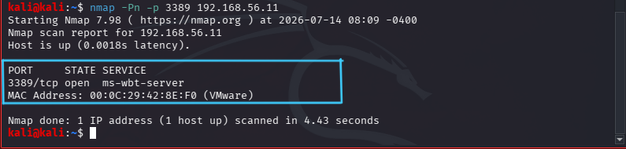
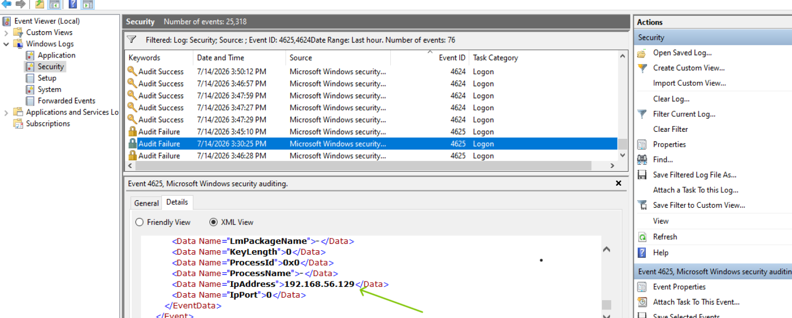

# Lab 12 – Investigating Remote Desktop Login Attempts Against a Windows 10 Host

## Scenario

The Security Operations Center (SOC) receives an alert indicating multiple Remote Desktop Protocol (RDP) authentication attempts against a Windows 10 workstation. As a Tier 1 SOC Analyst, your task is to investigate the authentication events, determine whether they represent normal user behavior or a potential brute-force attack, and document your findings.

## Objectives

Enable Remote Desktop on Windows.

Connect from Kali using xfreerdp.

Generate both failed and successful RDP logins.

Investigate Windows Security Event Logs.

Identify the source IP, targeted account, logon type, and outcome.

Document findings in a SOC-style report.

## Phase 1 — Prepare the Environment

### Step 1: Verify IP Addresses

Windows

```cmd
ipconfig
```


ip addr: 192.168.56.11

kali

```bash
ip a
```


## Environment

| Machine    | Operating System | IP Address    | Role          |
| ---------- | ---------------- | ------------- | ------------- |
| Kali Linux | Kali Linux       | 192.168.56.129 | Remote Client |
| Windows 10 | Windows 10 Pro   | 192.168.56.11 | Target        |

## Phase 2 — Verify Port 3389 (listening RDP port)

From kali

```bash
nmap -Pn -p 3389 192.168.56.11
```


### Observation

Nmap confirmed that TCP port 3389 was open, indicating that the Windows Remote Desktop service was accessible from the Kali Linux workstation.

## Phase 3 — Connect using RDP

verify xfreerdp if installed and version update if outdated

```bash
xfreerdp /version
```
installed 

## Phase 4 — Generate Failed Logins from attacker machine

```
xfreerdp /v:192.168.56.11 /u:Kiptoo
```
Enough to generate meaningful log entries without triggering unnecessary account lockouts (if configured).


## Phase 5 — Successful Login

```
xfreerdp /v:192.168.56.11 /u:Kiptoo
```


Successful RDP session.

## Phase 6 — Event Viewer Investigation

On Windows open:

Eventviewer - windows logs -security



Filter log :

- 4625 -   Failed Login  (logon type 2)
- 4624 -   Successful Login (logon type 3)

## Observation

During testing, failed authentication attempts were recorded as Logon Type 3 (Network), while the successful session was recorded as Logon Type 2 (Interactive). The events were correlated using their timestamps, the target account, and the successful RDP connection from the Kali Linux host. This demonstrates that multiple authentication-related events can be generated during a remote desktop session, and analysts should validate findings using multiple event fields rather than relying solely on the logon type.

## Investigation

For each event record:

| Field                  | Value |
| ---------------------- | ----- |
| Time Created           |       |
| Event ID               |       |
| Target Account         |       |
| Logon Type             |       |
| Source Network Address |       |
| Failure Reason         |       |
| Status                 |       |
| Authentication Package |       |
