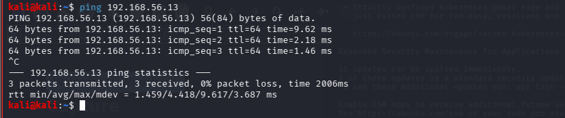

# Lab 07 - SSH Traffic Detection and Analysis Using Wireshark

## Objective

Analyze Secure Shell (SSH) traffic using Wireshark, observe the TCP connection establishment, identify the SSH protocol handshake, and understand how encryption protects the confidentiality of remote communications.

## Lab Environment

| Machine    | Operating System | Purpose                     |
| ---------- | ---------------- | --------------------------- |
| Kali Linux | Linux            | SSH Client & Packet Capture |
| Ubuntu     | Linux            | SSH Server                  |
| Wireshark  | Kali Linux       | Network Traffic Analysis    |


## Tools 

SSH – Secure remote administration protocol.

Wireshark – Network packet analyzer.

### Objective of the Attacker's Perspective

Establish a secure SSH session with the target and analyze the encrypted network traffic.

## Lab Procedure

Step 1: Verify Network Connectivity

```bash
ping 192.168.56.13
```


Step 2: Verify SSH Service status

```bash
sudo systemctl status ssh
```
Expected Result:

Active (running)


Step 3: Start Wireshark
```bash
wireshark
```

Step 4: Establish SSH Connection

```bash
ssh mkb@192.168.56.13
```


Step 5: Execute Simple Commands
```bash
whoami
hostname
pwd
ls
```
 (Executing commands over SSH)-Just to make sure you are in and active

 

Step 6: Close SSH Session

```
exit
```

## Wireshark Analysis

Apply the following filters

ssh

Shows only SSH packets.

Filter 2

tcp.port == 22

Shows all TCP traffic using port 22.

Filter 3

ip.addr == 192.168.56.13

Displays traffic to and from the Ubuntu machine.
