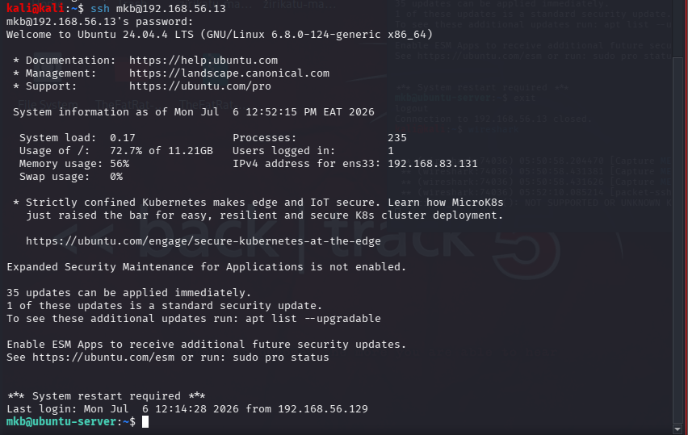
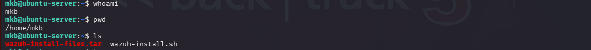
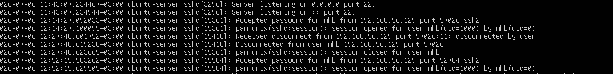
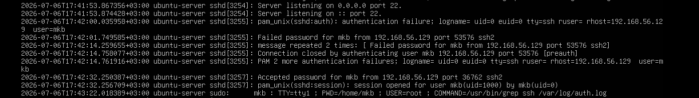
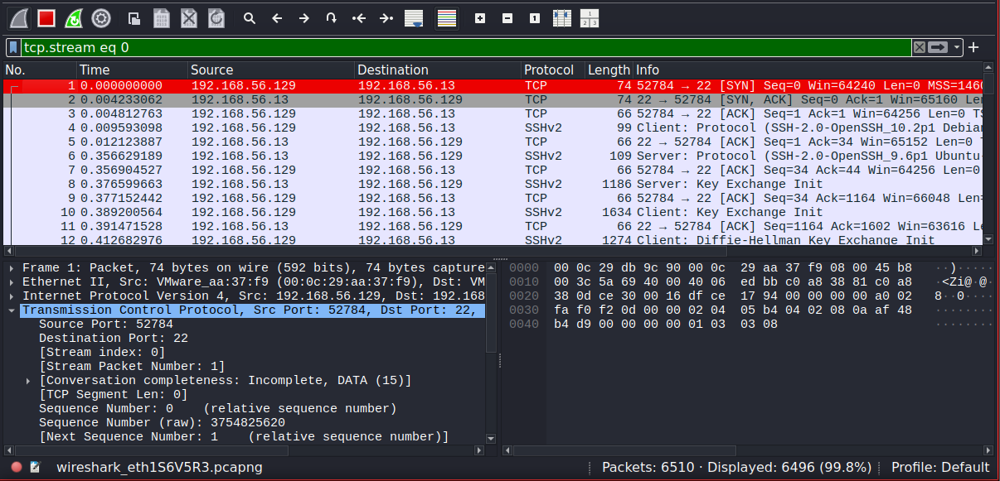
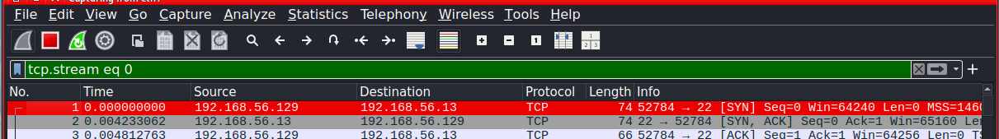
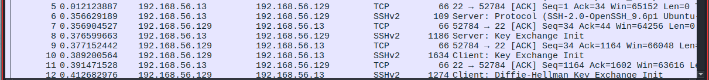
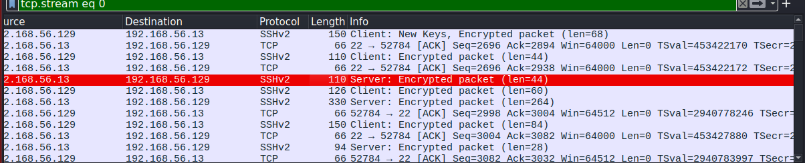

# Lab 07 - SSH Traffic Detection and Analysis Using Wireshark

## Objective

Analyze Secure Shell (SSH) traffic using Wireshark, observe the TCP connection establishment, identify the SSH protocol handshake, and understand how encryption protects the confidentiality of remote communications.

## Lab Environment

| Machine    | Operating System | Purpose                     |
| ---------- | ---------------- | --------------------------- |
| Kali Linux | Linux            | SSH Client & Packet Capture |
| Ubuntu     | Linux            | SSH Server                  |
| Wireshark  | Kali Linux       | Network Traffic Analysis    |


## Tools 

SSH – Secure remote administration protocol.

Wireshark – Network packet analyzer.

### Objective of the Attacker's Perspective

Establish a secure SSH session with the target and analyze the encrypted network traffic.

## Lab Procedure

### Step 1: Verify Network Connectivity

```bash
ping 192.168.56.13
```


### Step 2: Verify SSH Service status

```bash
sudo systemctl status ssh
```
Expected Result:

Active (running)


### Step 3: Start Wireshark
```bash
wireshark
```

### Step 4: Establish SSH Connection

```bash
ssh mkb@192.168.56.13
```


### Step 5: Execute Simple Commands
```bash
whoami
hostname
pwd
ls
```
 (Executing commands over SSH)-Just to make sure you are in and active

 

### Step 6: Close SSH Session

```
exit
```
From the server logs you can identify the ssh session logged with ip addr of the dev used and port



Instance of multiple login or filter to acccess 'Accepted password' or 'Failed password' in the logs



## Wireshark Analysis

Apply wireshark filters to obtain specific packet.



The captured traffic represents an active SSH session established between the Kali Linux client (192.168.56.129) and the Ubuntu SSH server (192.168.56.13). The packet capture confirms that the SSH protocol successfully established a secure, encrypted communication channel over TCP port 22.

### 1. SSH Session Establishment
   
i) 3 way handshake

   
   
ii)SSH key exchange

   

Observation

The SSH connection was successfully initiated after the TCP three-way handshake. Once the handshake completed, the SSH protocol negotiated cryptographic algorithms and exchanged encryption keys before transmitting any sensitive information.

Security Significance

This ensures that authentication credentials and all subsequent communication are protected against interception.

### 2. Source and Destination Analysis
   
| Field            | Value          |
| ---------------- | -------------- |
| Source IP        | 192.168.56.13  |
| Destination IP   | 192.168.56.129 |
| Protocol         | SSHv2          |
| Destination Port | TCP 22         |


Analysis

The packet originates from the Ubuntu server and is destined for the Kali Linux client. Communication occurs over TCP port 22, the default port used by SSH for secure remote administration.

### 3. SSH Version

The capture shows:
```
SSHv2
```
Analysis

The communication uses SSH Version 2, which is the industry standard secure version of the Secure Shell protocol. SSHv2 provides strong encryption, integrity verification, and authentication mechanisms to secure remote access.

### 4. Encrypted Packet Analysis



Analysis

This indicates that the SSH key exchange has already completed successfully and the session has transitioned into encrypted communication.

The payload cannot be inspected because it is protected using symmetric encryption negotiated during the SSH handshake.

### 5. TCP Analysis

The ACK flag confirms that the TCP connection is active and data is being acknowledged normally.

No retransmissions, resets, or abnormal TCP behavior were observed during the session.

### 6. Payload Analysis

Although packet contents are encrypted, Wireshark still provides useful metadata.

-Visible information includes:

Source IP, Destination IP, Source Port, Destination Port, Packet Length, Protocol, TCP Flags, Packet Timing

-Hidden information includes:

Password, Commands entered, Terminal output, Files transferred, Session contents

This demonstrates the effectiveness of SSH encryption.

### Security Findings

✅ SSH communication successfully established over TCP port 22.

✅ TCP session completed normally without retransmissions or connection resets.

✅ SSH Version 2 was used throughout the session.

✅ Application-layer data was encrypted after the SSH handshake.

✅ Sensitive information remained protected from packet inspection.

## Key Takeaways

SSH uses TCP port 22 to provide secure remote administration.

A TCP three-way handshake is completed before SSH communication begins.

SSH negotiates cryptographic algorithms and encryption keys before transmitting sensitive information.

After authentication, all application-layer data becomes encrypted.

Wireshark can identify SSH traffic but cannot decrypt the protected payload.

Security analysts can still investigate SSH sessions using metadata and authentication logs.

Encrypted protocols require defenders to rely on multiple data sources rather than packet contents alone.

## Real-World Detection Scenario

Scenario: An organization reports unauthorized remote access to a Linux server.

Investigation: Network monitoring identifies repeated SSH connections to TCP port 22 from an unfamiliar IP address. Wireshark confirms the presence of encrypted SSH sessions but cannot reveal the commands executed. The analyst correlates the network capture with Linux authentication logs (/var/log/auth.log) to determine whether authentication was successful, identify the user account involved, and establish an incident timeline.

Outcome: The analyst uses evidence from both network traffic and system logs to determine whether the SSH activity is legitimate administration or a potential compromise.

